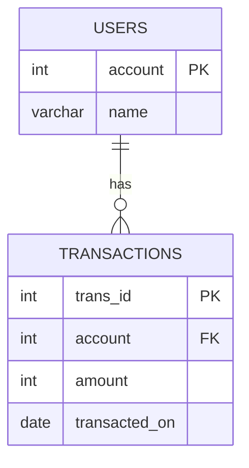

# [leetcode : 1587. Bank Account Summary II](https://leetcode.com/problems/bank-account-summary-ii/description/)

## **다이어그램**


## **목표**

> Write a solution to `report the name and balance of users with a balance higher than 10000. The balance of an account is equal to the sum of the amounts of all transactions involving that account.`
> `잔액이 10000보다 큰 사용자의 이름과 잔액 출력하기`

## **문제 풀이**

### **MySQL**

[tabs: Solution 1, Solution 2]

```sql
-- SOLUTION 1: JOIN + GROUP BY + HAVING
SELECT u.name, SUM(amount) AS balance
FROM users u
JOIN transactions t ON u.account = t.account
GROUP BY t.account
HAVING SUM(amount) > 10000
```

```sql
-- SOLUTION 2: JOIN + GROUP BY + HAVING
SELECT U.NAME, SUM(AMOUNT) AS BALANCE
FROM USERS U
JOIN TRANSACTIONS T ON U.ACCOUNT = T.ACCOUNT
GROUP BY U.ACCOUNT
HAVING SUM(AMOUNT) > 10000
```

[/tabs]

* SOLUTION 1, 2
  * account로 JOIN 후, GROUP BY + HAVING으로 출력해주기.
  * 개인적으로는 HAVING이나 ORDER BY에는 ALIAS를 쓴 상태로 넣는게 더 좋아보인다.

### **Pandas**

[tabs: Solution 1, Solution 2]

```python
# SOLUTION 1: merge on='account'
import pandas as pd

def account_summary(users: pd.DataFrame, transactions: pd.DataFrame) -> pd.DataFrame:
    joined = pd.merge(users, transactions, on='account')
    grouped = joined.groupby(['account','name']).agg(
        balance = ('amount','sum')
    ).reset_index()
    return grouped.loc[grouped['balance']>10000, ['name','balance']]
```

```python
# SOLUTION 2: merge (공통 컬럼 자동)
import pandas as pd

def account_summary(users: pd.DataFrame, transactions: pd.DataFrame) -> pd.DataFrame:
    joined = pd.merge(users, transactions)
    grouped = joined.groupby(['account','name']).agg(
        balance = ('amount','sum')
    ).reset_index()
    return grouped.loc[grouped['balance']>10000, ['name','balance']]
```

[/tabs]

* SOLUTION 1, 2
  * 마찬가지로 merge 이후, account, name으로 group by (account로만 묶으면 name 없어져서)
  * 이후에 조건 걸어줘서 출력
  * 다시 풀었는데 merge에 on 빼고는 똑같이 풀었다.
  * 겹치는 컬럼이 하나라서 겹치는 컬럼 굳이 안써도 되는데, 쓰는 방식으로 작성하기

## **코멘트**

* 쉽다
