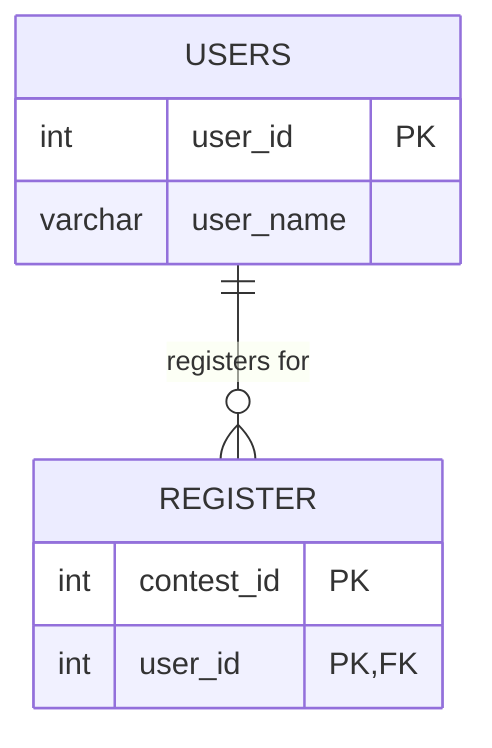

# [leetcode : 1633. Percentage of Users Attended a Contest](https://leetcode.com/problems/percentage-of-users-attended-a-contest/description/)

## **다이어그램**


## **목표**

> Write a solution to `find the percentage of the users registered in each contest rounded to two decimals. Return the result table ordered by percentage in descending order and then by contest_id in ascending order.`
> `각 대회에 참가한 사용자 비율 구하기`

## **문제 풀이**

### **MySQL**

[tabs: Solution 1, Solution 2]

```sql
-- SOLUTION 1: 서브쿼리
SELECT contest_id, ROUND(100*COUNT(*)/(SELECT COUNT(*) FROM users),2) AS percentage
FROM register
GROUP BY contest_id
ORDER BY percentage DESC, contest_id ASC
```

```sql
-- SOLUTION 2: 서브쿼리
SELECT 
    R.CONTEST_ID, 
    ROUND(100.0 * COUNT(*) / (SELECT COUNT(*) FROM USERS), 2) AS PERCENTAGE
FROM REGISTER R
GROUP BY R.CONTEST_ID
ORDER BY PERCENTAGE DESC, R.CONTEST_ID ASC
```

[/tabs]

* SOLUTION 1, 2
  * 전체 개수는 users에서 세준다.
  * 나머지는 GROUP BY + ORDER BY로 카운팅
  * users 테이블 수를 가져오는 부분에서 JOIN + COUNT로 가져오려고 하면 GROUP BY 때문에 집계가 힘들다.
  * 값은 USERS에서 바로 SELECT하기.

### **Pandas**

[tabs: Solution 1, Solution 2]

```python
# SOLUTION 1: agg + count
import pandas as pd

def users_percentage(users: pd.DataFrame, register: pd.DataFrame) -> pd.DataFrame:
    n = len(users)

    grouped = register.groupby('contest_id').agg(
        count = ('user_id','count')
    ).reset_index()

    grouped['percentage'] = round(100*grouped['count']/n,2)
    grouped.sort_values(by=['percentage','contest_id'], ascending=[False,True], inplace=True)
    return grouped.loc[:, ['contest_id','percentage']]
```

```python
# SOLUTION 2: size
import pandas as pd

def users_percentage(users: pd.DataFrame, register: pd.DataFrame) -> pd.DataFrame:
    grouped = register.groupby('contest_id').size().reset_index(name='percentage')
    grouped['percentage'] = round(100*grouped['percentage']/len(users),2)
    return grouped.sort_values(by=['percentage','contest_id'], ascending=[False,True]).loc[:, ['contest_id','percentage']]
```

[/tabs]

* SOLUTION 1
  * shape이든 len이든 count든 users 개수를 세준다.
  * 나머지는 group by + sort_values로 정렬해주기.
  * 다중 조건에는 by, ascending에 column, bool 전달해주기

* SOLUTION 2
  * size를 사용할 땐, 바로 이름할당 가능하니 size + 연산 + round로 답 구하기.

## **코멘트**

* 기본 문제
