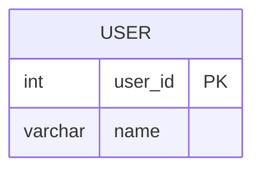

# [leetcode : 1667. Fix Names in a Table](https://leetcode.com/problems/fix-names-in-a-table/description/)

## **다이어그램**


## **목표**

> Write a solution to `fix the names so that only the first character is uppercase and the rest are lowercase.`
> `이름의 첫 글자만 대문자로, 나머지는 소문자로 변경하기`

## **문제 풀이**

### **MySQL**

[tabs: Solution 1]

```sql
-- SOLUTION 1: CONCAT + UPPER/LOWER
SELECT USER_ID, CONCAT(UPPER(LEFT(NAME,1)),LOWER(RIGHT(NAME,LENGTH(NAME)-1))) AS NAME
FROM USERS
ORDER BY USER_ID
```

[/tabs]

* SOLUTION 1
  * CONCAT으로 첫 글자 바꾸고, 나머지는 모두 소문자로 바꾸기.

### **Pandas**

[tabs: Solution 1, Solution 2]

```python
# SOLUTION 1: apply + capitalize
import pandas as pd

def fix_names(users: pd.DataFrame) -> pd.DataFrame:
    users = users.copy()
    users['name'] = users['name'].apply(lambda x: x.capitalize())
    return users.sort_values('user_id')
```

```python
# SOLUTION 2: str.capitalize
import pandas as pd

def fix_names(users: pd.DataFrame) -> pd.DataFrame:
    users = users.copy()
    users['name'] = users['name'].str.capitalize()
    return users.sort_values('user_id')
```

[/tabs]

* SOLUTION 1
  * 파이썬은 대문자 변환해주는 함수가 있다.
  * 한 단어는 title, 모든 단어 앞 글자 대문자는 capitalize

* SOLUTION 2
  * 바로 문자열에 접근해서, str capitalize를 사용한다.

## **코멘트**

* 테케 21번에 띄어쓰기로 구분된 케이스가 있어서 title말고 capitalize로 써야한다.
* 악질인게 SQL이랑 PANDAS 답이 다르다.
* SQL에서는 맨 앞글자만 대문자다.