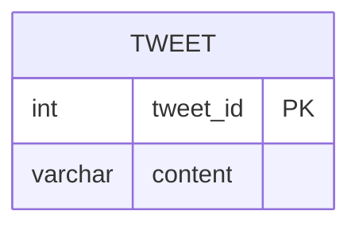

# [leetcode : 1683. Invalid Tweets](https://leetcode.com/problems/invalid-tweets/)

## **다이어그램**


## **목표**

> Write a solution to `find the IDs of the invalid tweets. The tweet is invalid if the number of characters used in the content of the tweet is strictly greater than 15.`
> `트윗 문자열 길이가 15보다 큰 트윗 ID 구하기`

## **문제 풀이**

### **MySQL**

[tabs: Solution 1]

```sql
-- SOLUTION 1: LENGTH
SELECT TWEET_ID
FROM TWEETS
WHERE LENGTH(CONTENT) > 15
```

[/tabs]

* SOLUTION 1
  * 단순 LENGTH 사용

### **Pandas**

[tabs: Solution 1, Solution 2]

```python
# SOLUTION 1: str.len()
import pandas as pd

def invalid_tweets(tweets: pd.DataFrame) -> pd.DataFrame:
    return tweets.loc[tweets['content'].str.len()>15, ['tweet_id']]
```

```python
# SOLUTION 2: 조건 변수
import pandas as pd

def invalid_tweets(tweets: pd.DataFrame) -> pd.DataFrame:
    cond = tweets['content'].str.len() > 15
    return tweets.loc[cond, ['tweet_id']]
```

[/tabs]

* SOLUTION 1
  * 간단한 조건 걸어주기.
  * len(tweets['content'])로 접근하면 열 전체에 길이가 나와서 안된다.
  * 각 행 정보에 접근해야하니 str.len()

* SOLUTION 2
  * cond로 조건 생성해서 인자로 넘겨주기.

## **코멘트**

* 기본 문제
