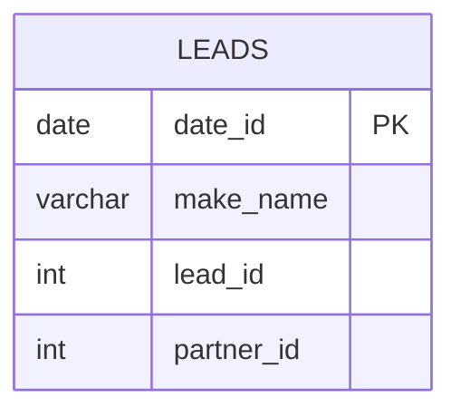

# [leetcode : 1693. Daily Leads and Partners](https://leetcode.com/problems/daily-leads-and-partners/description/)

## **다이어그램**


## **목표**

> Write a solution to `for each date_id and make_name, find the number of distinct lead_id's and distinct partner_id's.`
> `각 날짜, 이름별 고유 lead, partner id 개수 카운팅`

## **문제 풀이**

### **MySQL**

[tabs: Solution 1, Solution 2]

```sql
-- SOLUTION 1: COUNT DISTINCT
SELECT DATE_ID, MAKE_NAME, COUNT(DISTINCT LEAD_ID) AS UNIQUE_LEADS, COUNT(DISTINCT PARTNER_ID) AS UNIQUE_PARTNERS
FROM DAILYSALES
GROUP BY DATE_ID, MAKE_NAME
```

```sql
-- SOLUTION 2: COUNT DISTINCT
SELECT
    DATE_ID AS date_id,
    make_name, 
    COUNT(DISTINCT LEAD_ID) AS unique_leads,
    COUNT(DISTINCT PARTNER_ID) AS unique_partners
FROM DAILYSALES
GROUP BY DATE_ID, MAKE_NAME
```

[/tabs]

* SOLUTION 1, 2
  * 단순 GROUP BY + COUNT DISTINCT 문제

### **Pandas**

[tabs: Solution 1, Solution 2]

```python
# SOLUTION 1: agg + nunique
import pandas as pd

def daily_leads_and_partners(daily_sales: pd.DataFrame) -> pd.DataFrame:
    grouped = daily_sales.groupby(['date_id','make_name']).agg(
        unique_leads = ('lead_id','nunique'),
        unique_partners = ('partner_id','nunique')
    ).reset_index()
    return grouped
```

```python
# SOLUTION 2: nunique + rename
import pandas as pd

def daily_leads_and_partners(daily_sales: pd.DataFrame) -> pd.DataFrame:
    grouped = (daily_sales.groupby(['date_id','make_name']).nunique()
        .reset_index().rename(columns={"lead_id":"unique_leads", "partner_id":"unique_partners"}))
    return grouped
```

[/tabs]

* SOLUTION 1
  * 단순 group by + nunique 문제

* SOLUTION 2
  * 공통으로 nunique를 집계하고, 테이블에 집계 컬럼이 정해져있어서 바로 nunique로 설정하고 rename을 쓰자.

## **코멘트**

* 쉬운 문제
