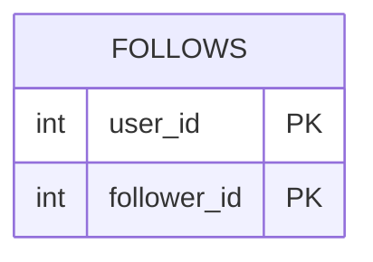

# [leetcode : 1729. Find Followers Count](https://leetcode.com/problems/find-followers-count/description/)

## **다이어그램**


## **목표**

> Write a solution that will, for each user, return the number of followers. Return the result table ordered by user_id in ascending order.
> `각 유저별 팔로워 수 구하기`

## **문제 풀이**

### **MySQL**

[tabs: Solution 1, Solution 2]

```sql
-- SOLUTION 1: COUNT
SELECT USER_ID, COUNT(*) AS FOLLOWERS_COUNT
FROM FOLLOWERS
GROUP BY USER_ID
ORDER BY USER_ID
```

```sql
-- SOLUTION 2: COUNT DISTINCT
SELECT USER_ID, COUNT(DISTINCT FOLLOWER_ID) AS FOLLOWERS_COUNT
FROM FOLLOWERS
GROUP BY USER_ID
```

[/tabs]

* SOLUTION 1
  * 단순 GROUP BY + COUNT 문제

* SOLUTION 2
  * 중복 팔로잉이 존재할거같아서 COUNT DISTINCT를 사용했다.

### **Pandas**

[tabs: Solution 1, Solution 2]

```python
# SOLUTION 1: agg + size
import pandas as pd

def count_followers(followers: pd.DataFrame) -> pd.DataFrame:
    grouped = followers.groupby('user_id').agg(
        followers_count = ('follower_id','size')
    ).reset_index()
    return grouped.sort_values('user_id')
```

```python
# SOLUTION 2: agg + nunique
import pandas as pd

def count_followers(followers: pd.DataFrame) -> pd.DataFrame:
    grouped = followers.groupby(by=['user_id']).agg(
        followers_count = ('follower_id','nunique')
    ).reset_index()
    return grouped.sort_values('user_id')
```

[/tabs]

* SOLUTION 1
  * 단순 group by + size 문제

* SOLUTION 2
  * 중복 id가 발생하는걸 고려해서 nunique를 썼는데 정답은 똑같다.

## **코멘트**

* 쉬운 문제