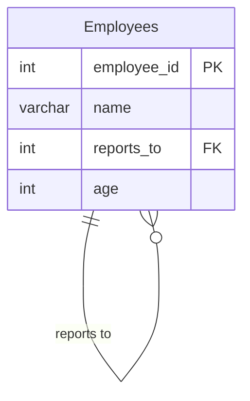

# [leetcode : 1731. The Number of Employees Which Report to Each Employee](https://leetcode.com/problems/the-number-of-employees-which-report-to-each-employee/description/)

## **다이어그램**


## **목표**

> Write a solution to `report the ids and the names of all managers, the number of employees who report directly to them, and the average age of the reports rounded to the nearest integer.`
> `각 매니저별 보고받는 직원 수와 보고받는 직원들의 평균 나이 구하기`

## **문제 풀이**

### **MySQL**

[tabs: Solution 1, Solution 2]

```sql
-- SOLUTION 1: CTE + IS NOT NULL
WITH TEMP AS (
    SELECT REPORTS_TO AS EMPLOYEE_ID, COUNT(*) AS REPORTS_COUNT, ROUND(AVG(AGE)) AS AVERAGE_AGE
    FROM EMPLOYEES
    WHERE REPORTS_TO IS NOT NULL
    GROUP BY REPORTS_TO
)
SELECT E.EMPLOYEE_ID, E.NAME, T.REPORTS_COUNT, T.AVERAGE_AGE
FROM EMPLOYEES E
JOIN TEMP T ON E.EMPLOYEE_ID = T.EMPLOYEE_ID
ORDER BY E.EMPLOYEE_ID
```

```sql
-- SOLUTION 2: CTE
WITH REPORTS AS (
    SELECT
        REPORTS_TO AS EMPLOYEE_ID,
        COUNT(*) AS REPORTS_COUNT,
        ROUND(AVG(AGE)) AS AVERAGE_AGE
    FROM EMPLOYEES
    GROUP BY REPORTS_TO
)
SELECT E.EMPLOYEE_ID, E.NAME, R.REPORTS_COUNT, R.AVERAGE_AGE
FROM EMPLOYEES E
JOIN REPORTS R ON E.EMPLOYEE_ID = R.EMPLOYEE_ID
ORDER BY E.EMPLOYEE_ID
```

[/tabs]

* SOLUTION 1
  * TEMP에 미리 GROUP BY + COUNT / ROUND(AVG)로 특정 인원을 뽑은 사람 수와 그 사람들의 평균 나이를 구한다.
  * 이후 JOIN

* SOLUTION 2
  * 같은 방식으로 풀이.
  * 굳이 is not null로 지정을 안해도 된다.

### **Pandas**

[tabs: Solution 1, Solution 2]

```python
# SOLUTION 1: agg + lambda
import pandas as pd

def count_employees(employees: pd.DataFrame) -> pd.DataFrame:
    grouped = employees.groupby('reports_to').agg(
        reports_count = ('reports_to','count'),
        average_age = ('age', lambda x: int(x.mean()+0.5))
    ).reset_index()

    joined = pd.merge(employees, grouped, left_on='employee_id', right_on='reports_to')
    joined.sort_values(by='employee_id', inplace=True)
    return joined.loc[:, ['employee_id','name','reports_count','average_age']]
```

```python
# SOLUTION 2: agg + round
import pandas as pd

def count_employees(employees: pd.DataFrame) -> pd.DataFrame:
    grouped = employees.groupby('reports_to').agg(
        reports_count = ('reports_to','size'),
        average_age = ('age', lambda group: (group.mean()+1e-9).round())
    ).reset_index()

    merged = pd.merge(grouped, employees, left_on='reports_to', right_on='employee_id')
    return merged.loc[:, ['employee_id','name','reports_count','average_age']].sort_values('employee_id')
```

[/tabs]

* SOLUTION 1
  * groupby로 count / round를 구해준다. -> 사사오입으로 오류나서 custom function 사용해야 하는듯?
  * 이후 merge를 통해 합쳐주고 sort_values 사용해주기

* SOLUTION 2
  * 0.5 + round를 0.5 + int인줄 알고 조금 삽질했다.
  * 마찬가지로 mean 이후 round 해주기.
  * 인자로 들어오는 group에서 한 번에 집계를 해준다.

## **코멘트**

* 기본 문제
