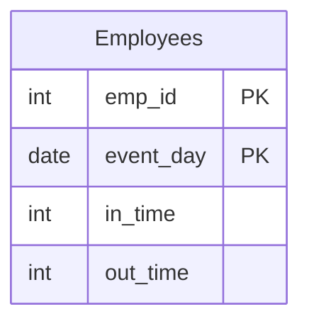

# [leetcode : 1741. Find Total Time Spent by Each Employee](https://leetcode.com/problems/find-total-time-spent-by-each-employee/description/)

## **다이어그램**



## **목표**

> Write a solution to `calculate the total time in minutes spent by each employee on each day at the office. Note that within one day, an employee can enter and leave more than once. The time spent in the office on a single day is the sum of all differences between the in_time and out_time for that day.`
> `각 직원이 각 날짜에 사무실에서 보낸 총 시간(분) 구하기`

<br>

## **문제 풀이**

### **MySQL**

[tabs: Solution 1, Solution 2]

```sql
-- SOLUTION 1: CTE + 차이 계산 후 SUM
WITH TEMP AS (
    SELECT EVENT_DAY, EMP_ID, OUT_TIME-IN_TIME AS TOTAL_TIME
    FROM EMPLOYEES
)
SELECT EMP_ID, EVENT_DAY AS `DAY`, SUM(TOTAL_TIME) AS TOTAL_TIME
FROM TEMP
GROUP BY EMP_ID, `DAY`
```

```sql
-- SOLUTION 2: CTE + SUM 후 차이 계산
WITH TEMP AS (
    SELECT EMP_ID, EVENT_DAY, SUM(IN_TIME) AS TOTAL_IN, SUM(OUT_TIME) AS TOTAL_OUT
    FROM EMPLOYEES
    GROUP BY EMP_ID, EVENT_DAY
)
SELECT EVENT_DAY AS DAY, EMP_ID, TOTAL_OUT-TOTAL_IN AS TOTAL_TIME
FROM TEMP
```

[/tabs]

* SOLUTION 1
  * CTE 하나 만들어서 출입시간 차이 계산해준다.
  * 이후 GROUP BY + SUM

* SOLUTION 2
  * CTE에서 먼저 집계를 하고, 메인 쿼리에서 OUT - IN을 해준다.
  * PANDAS와 다르게, 아래 쿼리 실행속도가 좀 더 빨랐다.

### **Pandas**

[tabs: Solution 1, Solution 2]

```python
# SOLUTION 1: 차이 계산 후 groupby
import pandas as pd

def total_time(employees: pd.DataFrame) -> pd.DataFrame:
    employees = employees.copy()
    employees['spend_time'] = employees['out_time']-employees['in_time']
    grouped = employees.groupby(['event_day','emp_id']).agg(
        total_time = ('spend_time','sum')
    ).reset_index()
    grouped.rename(columns={'event_day': 'day'}, inplace=True)
    return grouped
```

```python
# SOLUTION 2: groupby 후 차이 계산
import pandas as pd

def total_time(employees: pd.DataFrame) -> pd.DataFrame:
    grouped = employees.groupby(by=['event_day','emp_id']).agg(
        total_in = ('in_time','sum'),
        total_out = ('out_time','sum'),
    ).reset_index()
    grouped['total_time'] = grouped['total_out']-grouped['total_in']
    grouped = grouped.rename(columns = {'event_day':'day'})
    return grouped.loc[:, ['day','emp_id','total_time']]
```

[/tabs]

* SOLUTION 1
  * 같은 방법으로 소요시간 컬럼 하나 할당해주기.
  * 이후 group by + sum -> rename으로 정답 구하기

* SOLUTION 2
  * groupby + agg 이후에 total time을 새로 할당했다.
  * 집계를 groupby에서 두 컬럼에 대해서 진행해서 속도가 위 코드보다 좀 느린 것 같다.
  * groupby 과정에서 여러 컬럼을 생성하지 않도록 미리 처리를 하고 groupby를 진행하자.

## **코멘트**

* 언어마다 실행구조도 다르고, 옵티마이저도 같은 쿼리도 다르게 실행시킬 수 있다.
* 큰 틀에서 벗어나지 않는다면 가독성이 좋은 코드 위주로 작성하기.