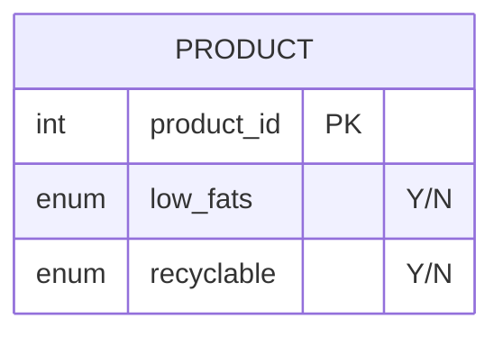

# [leetcode : 1757. Recyclable and Low Fat Products](https://leetcode.com/problems/recyclable-and-low-fat-products/description/)

## **다이어그램**


## **목표**

> Write a solution to `find the ids of products that are both low fat and recyclable.`
> `low_fats와 recyclable이 모두 'Y'인 제품 ID 구하기`

## **문제 풀이**

### **MySQL**

[tabs: Solution 1]

```sql
-- SOLUTION 1: WHERE + AND
SELECT PRODUCT_ID
FROM PRODUCTS
WHERE LOW_FATS='Y' AND RECYCLABLE='Y'
```

[/tabs]

* SOLUTION 1
  * 기본 필터링 문제

### **Pandas**

[tabs: Solution 1]

```python
# SOLUTION 1: 조건 필터링
import pandas as pd

def find_products(products: pd.DataFrame) -> pd.DataFrame:
    return products.loc[(products['low_fats']=='Y') & (products['recyclable']=='Y'), ['product_id']]
```

[/tabs]

* SOLUTION 1
  * 기본 필터링 문제

## **코멘트**

* 기본 문제