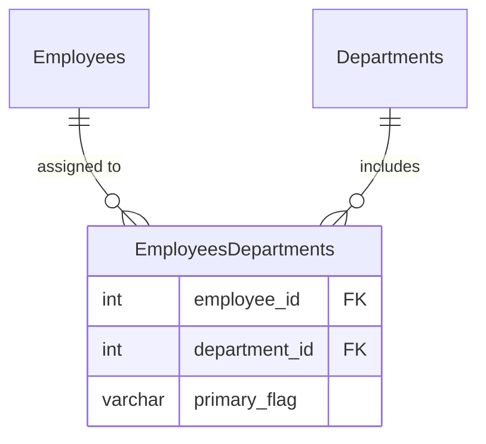

# [leetcode : 1789. Primary Department for Each Employee](https://leetcode.com/problems/primary-department-for-each-employee/description/)

## **다이어그램**


## **목표**

> Write a solution to `report all the employees with their primary department. For employees who belong to one department, report their only department. For employees who belong to multiple departments, report their primary department. Note that if an employee belongs to multiple departments, one of them is primary.`
> `각 직원의 주요 부서 찾기 (부서가 1개면 그 부서, 여러 개면 primary_flag='Y'인 부서)`

## **문제 풀이**

### **MySQL**

[tabs: Solution 1, Solution 2]

```sql
-- SOLUTION 1: UNION
SELECT EMPLOYEE_ID, DEPARTMENT_ID
FROM EMPLOYEE
GROUP BY EMPLOYEE_ID
HAVING COUNT(*) = 1

UNION

SELECT EMPLOYEE_ID, DEPARTMENT_ID
FROM EMPLOYEE
WHERE PRIMARY_FLAG = 'Y'
```

```sql
-- SOLUTION 2: ROW_NUMBER
WITH TEMP AS (
    SELECT
        EMPLOYEE_ID,
        DEPARTMENT_ID,
        ROW_NUMBER() OVER (PARTITION BY EMPLOYEE_ID
                        ORDER BY PRIMARY_FLAG DESC, DEPARTMENT_ID ASC) AS RN
    FROM EMPLOYEE
)
SELECT EMPLOYEE_ID, DEPARTMENT_ID
FROM TEMP
WHERE RN = 1
```

[/tabs]

* SOLUTION 1
  * GROUP BY + HAVING으로 부서가 한 개인 사람만 구하기
  * WHERE 조건으로 PRIMARY 부서가 지정된 (부서 두 개 이상인) 사람 구하기

* SOLUTION 2
  * 각 사람별로 ROW_NUMBER를 걸어준다.
  * 정렬 조건에 FLAG가 Y인 사람이 먼저 올 수 있게 DESC로 가져온다.
  * 나머지는 DEPARTMENT_ID로 가져오기.

### **Pandas**

[tabs: Solution 1, Solution 2]

```python
# SOLUTION 1: sort_values + drop_duplicates
import pandas as pd

def find_primary_department(employee: pd.DataFrame) -> pd.DataFrame:
    employee = employee.copy()
    employee.sort_values(by=['employee_id', 'primary_flag'], inplace=True)
    employee.drop_duplicates(subset='employee_id', keep='last', inplace=True)
    return employee.loc[:, ['employee_id', 'department_id']]
```

```python
# SOLUTION 2: sort_values + cumcount
import pandas as pd

def find_primary_department(employee: pd.DataFrame) -> pd.DataFrame:
    employee = employee.copy()
    employee = employee.sort_values(by=['employee_id','primary_flag','department_id'],
                                    ascending=[True,False,True])
    employee['rn'] = employee.groupby('employee_id').cumcount()
    return employee.loc[employee['rn']==0, ['employee_id','department_id']]
```

[/tabs]

* SOLUTION 1
  * sort_values + drop_duplicates
  * y는 각 사람별로 한 번만 나온다는점을 생각해서 사람별로 flag를 정렬한다.
  * keep last를 걸어놓으면 마지막이 y인 부서를 가져올 수 있다.

* SOLUTION 2
  * 정렬 + cumcount로 groupby별 row number 구하기.
  * row number가 0인 row 뽑기.

## **코멘트**

* 기본 문제
