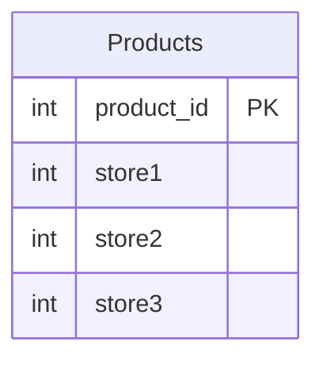

# [leetcode : 1795. Rearrange Products Table](https://leetcode.com/problems/rearrange-products-table/description/)

## **다이어그램**



## **목표**

> Write a solution to `rearrange the Products table so that each row has (product_id, store, price). If a product is not available in a store, do not include a row with that product_id and store combination in the result table.`
> `테이블을 재구성하여 각 행이 (product_id, store, price) 형태가 되도록 하기 (UNPIVOT)`

## **문제 풀이**

### **MySQL**

[tabs: Solution 1]

```sql
-- SOLUTION 1: UNION ALL
WITH TEMP AS (
  SELECT product_id, 'store1' AS store, store1 AS price
  FROM products
  UNION ALL
  SELECT product_id, 'store2' AS store, store2 AS price
  FROM products
  UNION ALL
  SELECT product_id, 'store3' AS store, store3 AS price
  FROM products
)
SELECT *
FROM TEMP
WHERE price IS NOT NULL
```

[/tabs]

* SOLUTION 1
  * 대소문자를 구분하는 문제인듯? 대문자로 쓰니까 통과를 못함...
  * 각 컬럼별로 접근해서 UNION ALL 3번 해주기

### **Pandas**

[tabs: Solution 1]

```python
# SOLUTION 1: melt
import pandas as pd

def rearrange_products_table(products: pd.DataFrame) -> pd.DataFrame:
    melted = pd.melt(products, id_vars='product_id', var_name='store', value_name='price')
    return melted.loc[~melted['price'].isnull(), :]
```

[/tabs]

* SOLUTION 1
  * 파이썬에는 무조건 이런 피벗관련 메서드가 있을 것 같아서 찾아보니까, melt 메서드를 사용한다.
  * id_vars에는 기준 컬럼을, var_name에는 피벗 해제할 컬럼을, value_name에는 값을 적는다.

## **코멘트**

* 기본 문제
