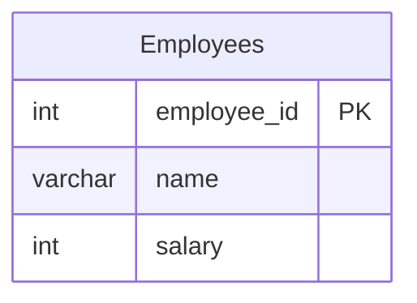

# [leetcode : 1873. Calculate Special Bonus](https://leetcode.com/problems/calculate-special-bonus/description/)

## **다이어그램**


## **목표**

> Write a solution to `calculate the bonus of each employee. The bonus of an employee is 100% of their salary if the ID of the employee is an odd number and the employee's name does not start with the character 'M'. The bonus of an employee is 0 otherwise.`
> `employee_id가 홀수이고 이름이 'M'으로 시작하지 않는 경우 보너스는 급여의 100%, 그 외는 0`

## **문제 풀이**

### **MySQL**

[tabs: Solution 1, Solution 2]

```sql
-- SOLUTION 1: IF + OR
SELECT EMPLOYEE_ID, IF(EMPLOYEE_ID%2=0 OR SUBSTR(NAME,1,1)='M',0,SALARY) AS BONUS
FROM EMPLOYEES
ORDER BY EMPLOYEE_ID
```

```sql
-- SOLUTION 2: IF + AND + LIKE
SELECT 
    EMPLOYEE_ID,
    IF(NAME NOT LIKE "M%" AND EMPLOYEE_ID%2=1 , SALARY, 0) AS BONUS
FROM EMPLOYEES
ORDER BY EMPLOYEE_ID
```

[/tabs]

* SOLUTION 1
  * CASE WHEN보다 IF 내에 OR로 조건걸어서 쓰는게 더 깔끔해보인다.
  * AND 대신 OR쓰는게 더 빨라서 OR 사용.

* SOLUTION 2
  * SUBSTR이나 LEFT 대신 LIKE 사용해서 풀이.

### **Pandas**

[tabs: Solution 1, Solution 2]

```python
# SOLUTION 1: np.where + OR
import pandas as pd
import numpy as np

def calculate_special_bonus(employees: pd.DataFrame) -> pd.DataFrame:
    employees = employees.copy()
    employees['bonus'] = np.where((employees['employee_id']%2==0) | (employees['name'].str[0] == 'M'), 0, employees['salary'])
    return employees.loc[:, ['employee_id', 'bonus']].sort_values(by='employee_id')
```

```python
# SOLUTION 2: np.where + AND
import pandas as pd
import numpy as np

def calculate_special_bonus(employees: pd.DataFrame) -> pd.DataFrame:
    employees = employees.copy()
    employees['bonus'] = np.where((employees['employee_id']%2==1)&(employees['name'].str[0]!='M'),
                                    employees['salary'],0)
    return employees.loc[:, ['employee_id','bonus']].sort_values(by='employee_id')
```

[/tabs]

* SOLUTION 1
  * 숏서킷을 사용해서 풀이.
  * OR에서 하나만 True여도 나머지는 검사를 안해도 되니까, 조건이 많을 때 효율적이다.

* SOLUTION 2
  * 이전에는 숏서킷으로 풀었는데, 지금은 그냥 조건 주어진대로 작성했다.
  * 데이터 분포를 알고 있어서 쿼리 작성에 크게 이득을 볼 수 있는게 아니면 문제 풀이시에는 주어진대로 작성하자.

## **코멘트**

* M으로 시작하는 것 보다, M으로 시작하지 않는 것이 더 많은 imbalanced라서 고려해서 풀었으면 더 좋았을 듯?
