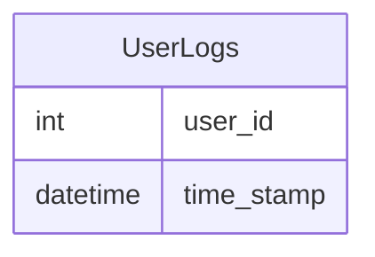

# [leetcode : 1890. The Latest Login in 2020](https://leetcode.com/problems/the-latest-login-in-2020/description/)

## **다이어그램**


## **목표**

> Write a solution to `report the latest login for all users in the year 2020. Do not include the users who did not login in 2020.`
> `2020년 로그인한 사용자들의 가장 최근 로그인 시간 구하기`

## **문제 풀이**

### **MySQL**

[tabs: Solution 1, Solution 2]

```sql
-- SOLUTION 1: GROUP BY + MAX
SELECT USER_ID, MAX(TIME_STAMP) AS LAST_STAMP
FROM LOGINS
WHERE YEAR(TIME_STAMP) = '2020'
GROUP BY USER_ID
```

```sql
-- SOLUTION 2: ROW_NUMBER
WITH TEMP AS (
    SELECT *, ROW_NUMBER() OVER (PARTITION BY USER_ID ORDER BY TIME_STAMP DESC) AS RN
    FROM (SELECT *
        FROM LOGINS
        WHERE YEAR(TIME_STAMP) = 2020) T
)
SELECT USER_ID, TIME_STAMP AS LAST_STAMP
FROM TEMP
WHERE RN = 1
```

[/tabs]

* SOLUTION 1
  * GROUP BY + MAX

* SOLUTION 2
  * WHERE + ROW_NUMBER + WHERE로 풀이.
  * 간단한 조건문만 있는 경우, CTE말고 서브쿼리도 괜찮은듯

### **Pandas**

[tabs: Solution 1, Solution 2]

```python
# SOLUTION 1: sort_values + drop_duplicates
import pandas as pd

def latest_login(logins: pd.DataFrame) -> pd.DataFrame:
    logins = logins.copy()
    logins.sort_values(by='time_stamp', inplace=True)
    answer = logins[logins['time_stamp'].dt.year == 2020].drop_duplicates(subset='user_id', keep='last')
    return answer.rename(columns={'time_stamp': 'last_stamp'}).loc[:, ['user_id', 'last_stamp']]
```

```python
# SOLUTION 2: groupby + max
import pandas as pd

def latest_login(logins: pd.DataFrame) -> pd.DataFrame:
    log2020 = logins[logins['time_stamp'].dt.year==2020]
    grouped = log2020.groupby('user_id').max().reset_index().rename(columns={'time_stamp':'last_stamp'})
    return grouped.loc[:, ['user_id', 'last_stamp']]
```

[/tabs]

* SOLUTION 1
  * sort_values + drop duplicate
  * DESC 정렬에 keep first가 더 효율적인 것 같음.

* SOLUTION 2
  * cond + groupby + max

## **코멘트**

* 기본 문제
