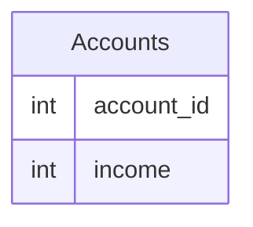

# [leetcode : 1907. Count Salary Categories](https://leetcode.com/problems/count-salary-categories/description/)

## **다이어그램**


## **목표**

> Write a solution to `calculate the number of bank accounts for each salary category. The salary categories are: "Low Salary": All the salaries strictly less than $20000. "Average Salary": All the salaries in the inclusive range [$20000, $50000]. "High Salary": All the salaries strictly greater than $50000.`
> `각 소득 그룹별 계정 수 구하기 (Low: <20000, Average: 20000-50000, High: >50000)`

## **문제 풀이**

### **MySQL**

[tabs: Solution 1, Solution 2]

```sql
-- SOLUTION 1: 더미 데이터 추가
WITH TEMP2 AS (
    SELECT *,
           CASE
               WHEN INCOME > 50000 THEN 'High Salary'
               WHEN INCOME < 20000 THEN 'Low Salary'
               ELSE 'Average Salary'
           END AS SALARY_CATEGORY
    FROM (
        SELECT * FROM ACCOUNTS
        UNION ALL
        SELECT 0,0
        UNION ALL
        SELECT 0, 20000
        UNION ALL
        SELECT 0, 50001
    ) AS TEMP1
)
SELECT SALARY_CATEGORY AS 'category', COUNT(*)-1 AS 'accounts_count'
FROM TEMP2
GROUP BY SALARY_CATEGORY
```

```sql
-- SOLUTION 2: LEFT JOIN
WITH INCOME_LEVEL AS (
    SELECT 'High Salary' AS CATEGORY
    UNION ALL
    SELECT 'Average Salary'
    UNION ALL
    SELECT 'Low Salary'
)
SELECT 
    IL.CATEGORY,
    COALESCE(COUNT(I.CATEGORY), 0) AS ACCOUNTS_COUNT
FROM 
    INCOME_LEVEL IL
LEFT JOIN (
    SELECT 
        CASE
            WHEN INCOME > 50000 THEN 'High Salary'
            WHEN INCOME BETWEEN 20000 AND 50000 THEN 'Average Salary'
            ELSE 'Low Salary' 
        END AS CATEGORY
    FROM ACCOUNTS
) I
ON IL.CATEGORY = I.CATEGORY
GROUP BY IL.CATEGORY
```

[/tabs]

* SOLUTION 1
  * 소득 구간 표본이 없는 경우 GROUP BY에 없어서 더미 데이터를 추가한다.

* SOLUTION 2
  * 소득 구간 표본이 없는 경우 GROUP BY에 없어서 더미 데이터를 추가한다.

### **Pandas**

[tabs: Solution 1, Solution 2]

```python
# SOLUTION 1: 더미 데이터 + pd.cut
import pandas as pd
import numpy as np

def count_salary_categories(accounts: pd.DataFrame) -> pd.DataFrame:
    accounts = accounts.copy()
    accounts = pd.concat([accounts,
                        pd.DataFrame({'account_id': [0,0,0], 'income': [0,20000,50001]})],
                       ignore_index=True)

    accounts['category'] = pd.cut(accounts['income'], 
                            bins=[-np.inf, 20000, 50001, np.inf],
                            labels=['Low Salary', 'Average Salary', 'High Salary'], right=False)

    grouped = accounts.groupby('category').agg(
        accounts_count=('category', lambda x: x.size-1)
    ).reset_index()
    return grouped
```

```python
# SOLUTION 2: apply + LEFT JOIN
import pandas as pd

def get_level(row):
    if row['income'] > 50000:
        return 'High Salary'
    elif row['income'] < 20000:
        return 'Low Salary'
    return 'Average Salary'

def count_salary_categories(accounts: pd.DataFrame) -> pd.DataFrame:
    accounts = accounts.copy()
    accounts['category'] = accounts.apply(get_level, axis=1)
    grouped = accounts.groupby('category').size().reset_index(name='accounts_count')

    temp = pd.DataFrame({"category":[f'{level} Salary' for level in ["High","Low","Average"]]})
    merged = pd.merge(temp, grouped, on='category', how='left')
    merged['accounts_count'] = merged['accounts_count'].fillna(0)
    return merged
```

[/tabs]

* SOLUTION 1
  * 더미데이터 추가.

* SOLUTION 2
  * 함수 정의한 후, 카테고리가 비어있는 것을 방지하기 위한 temp 데이터프레임와 left join.
  * apply 사용 시 (함수, 축)

## **코멘트**

* 더미데이터고 뭐고 그냥 컬럼 설정 미리 할당해놓고 count로 하는게 제일 빠른 듯
```SQL
WITH TEMP2 AS (
    SELECT *,
           CASE
               WHEN INCOME > 50000 THEN 'High Salary'
               WHEN INCOME < 20000 THEN 'Low Salary'
               ELSE 'Average Salary'
           END AS SALARY_CATEGORY
    FROM (
        SELECT * FROM ACCOUNTS
        UNION ALL
        SELECT 0,0
        UNION ALL
        SELECT 0, 20000
        UNION ALL
        SELECT 0, 50001
    ) AS TEMP1
)

SELECT SALARY_CATEGORY AS 'category', COUNT(*)-1 AS 'accounts_count'
FROM TEMP2
GROUP BY SALARY_CATEGORY
```
