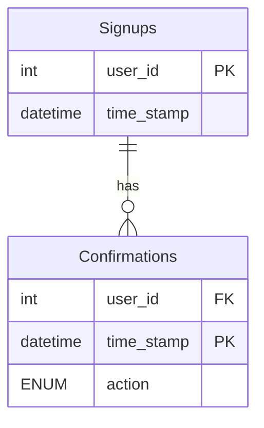

# [leetcode : 1934. Confirmation Rate](https://leetcode.com/problems/confirmation-rate/description/)

## **다이어그램**


## **목표**

> Write a solution to `find the confirmation rate of each user. The confirmation rate of a user is the number of 'confirmed' messages divided by the total number of requested confirmation messages. The confirmation rate should be rounded to 2 decimal places.`
> `각 사용자의 확인 비율 구하기 (confirmed 수 / 전체 요청 수)`

## **문제 풀이**

### **MySQL**

[tabs: Solution 1, Solution 2]

```sql
-- SOLUTION 1: COUNT IF
WITH TEMP AS (
    SELECT USER_ID, ROUND(COUNT(IF(ACTION='confirmed',1,NULL))/COUNT(*),2) AS rate
    FROM CONFIRMATIONS
    GROUP BY USER_ID
)
SELECT S.user_id, COALESCE(T.rate,0) AS confirmation_rate
FROM SIGNUPS AS S
LEFT JOIN TEMP AS T ON T.user_id = S.user_id
```

```sql
-- SOLUTION 2: SUM IF
WITH TEMP AS (
    SELECT
        USER_ID,
        ROUND(SUM(IF(ACTION='confirmed',1,0))/COUNT(*),2) AS CONFIRMATION_RATE
    FROM CONFIRMATIONS
    GROUP BY USER_ID
)
SELECT
    S.USER_ID,
    COALESCE(T.CONFIRMATION_RATE,0) AS CONFIRMATION_RATE
FROM
    (SELECT DISTINCT USER_ID FROM SIGNUPS) S
LEFT JOIN TEMP T ON S.USER_ID = T.USER_ID
```

[/tabs]

* SOLUTION 1
  * count if / count(*)로 비율 구해주기.
  * signups table에서 전체 유저를 가져와야해서 left join을 사용하고 null은 coalesce 사용

* SOLUTION 2
  * 비슷한 방식으로 풀이.
  * sum if를 사용해서 컨펌 수 / 전체 수를 구하기
  * left join, null 처리는 같은 방식으로 사용

### **Pandas**

[tabs: Solution 1, Solution 2]

```python
# SOLUTION 1: merge + lambda
import pandas as pd

def confirmation_rate(signups: pd.DataFrame, confirmations: pd.DataFrame) -> pd.DataFrame:
    joined = pd.merge(signups, confirmations, how='left', left_on='user_id', right_on='user_id')

    grouped = joined.groupby('user_id').agg(
        confirmation_rate=('action', lambda x: round(sum(x=='confirmed')/len(x),2))
    ).reset_index()
    return grouped
```

```python
# SOLUTION 2: np.where + mean
import pandas as pd
import numpy as np

def confirmation_rate(signups: pd.DataFrame, confirmations: pd.DataFrame) -> pd.DataFrame:
    confirmations = confirmations.copy()
    confirmations['confirm'] = np.where(confirmations['action']=='confirmed',1,0)
    grouped = confirmations.groupby('user_id').agg(
        confirmation_rate = ('confirm', lambda group: round(group.mean(),2))
    ).reset_index()

    merged = pd.merge(signups[['user_id']].drop_duplicates(), grouped, on='user_id', how='left')
    merged['confirmation_rate'] = merged['confirmation_rate'].fillna(0)
    return merged.loc[:, ['user_id','confirmation_rate']]
```

[/tabs]

* SOLUTION 1
  * groupby에서 lambda x의 인수는 group Series로 들어오니까, 여기서 연산해주면 된다.
  * apply에서 lambda x의 인수는 row DataFrame으로 들어오니까 차이를 인지하고 lambda 작성.

* SOLUTION 2
  * np.where로 컨펌된 사람들만 찾아주고, group by + lambda를 통해서 비율을 구해준다.
  * drop duplicates를 통해서 signups에 있는 unique한 id 찾기 (사실 unique for this table이어서 상관없긴하다)

## **코멘트**

* 기본 문제