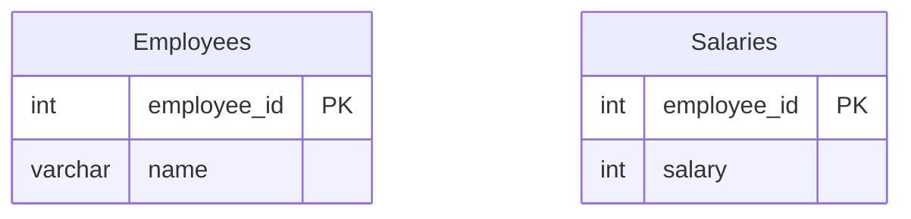

# [leetcode : 1965. Employees With Missing Information](https://leetcode.com/problems/employees-with-missing-information/description/)

## **다이어그램**



## **목표**

> Write a solution to `report the IDs of all the employees with missing information. The information of an employee is missing if: The employee's name is missing, or The employee's salary is missing.`
> `두 테이블을 비교하여 정보가 누락된 employee_id 구하기 (name 또는 salary가 없는 경우)`

<br>

## **문제 풀이**

### **MySQL**

[tabs: Solution 1, Solution 2, Solution 3]

```sql
-- SOLUTION 1: NOT IN + UNION
WITH MISSING AS (
    SELECT employee_id
    FROM EMPLOYEES
    WHERE employee_id NOT IN (SELECT employee_id FROM Salaries)
    UNION
    SELECT employee_id
    FROM Salaries
    WHERE employee_id NOT IN (SELECT employee_id FROM EMPLOYEES)
)
SELECT *
FROM MISSING
ORDER BY 1 ASC
```

```sql
-- SOLUTION 2: LEFT/RIGHT JOIN + IS NULL
WITH TEMP AS (
    SELECT E.EMPLOYEE_ID
    FROM EMPLOYEES E
    LEFT JOIN SALARIES S ON E.EMPLOYEE_ID = S.EMPLOYEE_ID
    WHERE S.SALARY IS NULL
    UNION
    SELECT S.EMPLOYEE_ID
    FROM EMPLOYEES E
    RIGHT JOIN SALARIES S ON E.EMPLOYEE_ID = S.EMPLOYEE_ID
    WHERE E.EMPLOYEE_ID IS NULL
)
SELECT *
FROM TEMP
ORDER BY EMPLOYEE_ID
```

```sql
-- SOLUTION 3: UNION ALL + GROUP BY + HAVING
WITH TEMP AS (
    SELECT E.EMPLOYEE_ID
    FROM EMPLOYEES E
    LEFT JOIN SALARIES S ON E.EMPLOYEE_ID = S.EMPLOYEE_ID
    UNION ALL
    SELECT S.EMPLOYEE_ID
    FROM EMPLOYEES E
    RIGHT JOIN SALARIES S ON E.EMPLOYEE_ID = S.EMPLOYEE_ID
)
SELECT *
FROM TEMP
GROUP BY EMPLOYEE_ID
HAVING COUNT(EMPLOYEE_ID) = 1
ORDER BY EMPLOYEE_ID
```

[/tabs]

* SOLUTION 1
  * JOIN에 IS NULL로 풀어도 됐을 것 같긴 한데, 서브쿼리 + CTE 쓴 후에 ORDER BY

* SOLUTION 2
  * JOIN + IS NULL 이후 UNION

* SOLUTION 3
  * UNION ALL 이후에 GROUP BY + HAVING COUNT로 한 번만 나온 것을 확인해주면 된다.

### **Pandas**

[tabs: Solution 1, Solution 2, Solution 3]

```python
# SOLUTION 1: isin + concat
import pandas as pd

def find_employees(employees: pd.DataFrame, salaries: pd.DataFrame) -> pd.DataFrame:
    temp1 = salaries.loc[~salaries['employee_id'].isin(employees['employee_id']), :]
    temp2 = employees.loc[~employees['employee_id'].isin(salaries['employee_id']), :]
    answer = pd.concat([temp1, temp2])
    return answer.loc[:, ['employee_id']].sort_values('employee_id')
```

```python
# SOLUTION 2: outer join + isna
import pandas as pd

def find_employees(employees: pd.DataFrame, salaries: pd.DataFrame) -> pd.DataFrame:
    merged = pd.merge(employees, salaries, on='employee_id', how='outer')
    return merged.loc[(merged['name'].isna()) | (merged['salary'].isna()), ['employee_id']]
```

```python
# SOLUTION 3: concat + groupby + size
import pandas as pd

def find_employees(employees: pd.DataFrame, salaries: pd.DataFrame) -> pd.DataFrame:
    concated = pd.concat([employees[['employee_id']], salaries[['employee_id']]])
    grouped = concated.groupby('employee_id').size().reset_index(name='count')
    return grouped.loc[grouped['count']==1, ['employee_id']].sort_values('employee_id')
```

[/tabs]

* SOLUTION 1
  * 처음에는 set으로 하나 둬서 풀었는데, isin으로도 안에서 포함유무를 확인할 수 있다는거 확인...

* SOLUTION 2
  * pandas에서는 outer join이 있어서, join 이후에 isna로 조건을 지정한다.

* SOLUTION 3
  * concat + groupby size + 조건 + 정렬
  * concat 진행 시 emp id만 확인할거라 메모리를 위해서 employees[['employee_id']], salaries[['employee_id']]로 접근해주는게 더 좋다.

## **코멘트**

* 쉬운 문제
