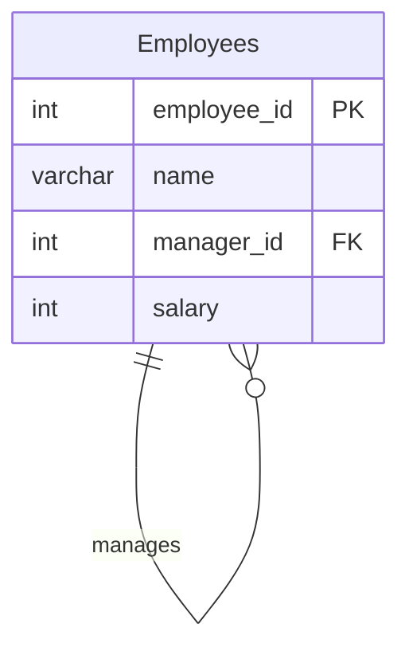

# [leetcode : 1978. Employees Whose Manager Left the Company](https://leetcode.com/problems/employees-whose-manager-left-the-company/description/)

## **다이어그램**


## **목표**

> Write a solution to `find the IDs of the employees whose salary is strictly less than $30000 and whose manager left the company. When a manager leaves the company, their information is deleted from the Employees table, but the reports still have their manager_id set to the manager that left.`
> `급여가 30000 미만이고 매니저가 회사를 떠난 직원의 ID 구하기`

## **문제 풀이**

### **MySQL**

[tabs: Solution 1, Solution 2]

```sql
-- SOLUTION 1: NOT IN
SELECT employee_id
FROM EMPLOYEES
WHERE SALARY < 30000 AND MANAGER_ID IS NOT NULL AND MANAGER_ID NOT IN (SELECT employee_id FROM EMPLOYEES)
ORDER BY employee_id
```

```sql
-- SOLUTION 2: NOT IN (가독성 개선)
SELECT EMPLOYEE_ID
FROM EMPLOYEES
WHERE
    SALARY < 30000 AND 
    MANAGER_ID IS NOT NULL AND
    MANAGER_ID NOT IN (SELECT EMPLOYEE_ID FROM EMPLOYEES)
ORDER BY EMPLOYEE_ID ASC
```

[/tabs]

* SOLUTION 1, 2
  * not in은 subquery 사용하기
  * 다중 컬럼, 조건, 조인 등 쿼리가 길어지는 경우, 가독성을 위해서 들여쓰기

### **Pandas**

[tabs: Solution 1, Solution 2]

```python
# SOLUTION 1: 조건 + dropna
import pandas as pd

def find_employees(employees: pd.DataFrame) -> pd.DataFrame:
    answer = employees.loc[(employees['salary']<30000) & (~employees['manager_id'].isin(employees['employee_id'])), :].dropna()
    return answer.loc[:, ['employee_id']].sort_values('employee_id')
```

```python
# SOLUTION 2: 조건 명시
import pandas as pd

def find_employees(employees: pd.DataFrame) -> pd.DataFrame:
    cond = (employees['salary'] < 30000) & (~employees['manager_id'].isna()) & (~employees['manager_id'].isin(employees['employee_id']))
    return employees.loc[cond, ['employee_id']].sort_values('employee_id')
```

[/tabs]

* SOLUTION 1
  * 조건 2개 걸어주기.
  * 매니저 조건 걸어줄 때 '매니저가 있고 & 떠난' 이라는 복합조건이므로 매니저가 null인 데이터는 볼 필요 없다.
  * dropna부터 해주는게 조금 더 빨랐을듯?

* SOLUTION 2
  * 일단 해당 직원의 salary가 3만 미만
  * 그리고 매니저가 아닌 직원들이니까, employee['manager_id']가 null이면 안된다.
  * 또한, 매니저가 있는데 해당 회사에 남아있어야 하므로 isin을 통해서 확인해주면된다.

## **코멘트**

* 복합 조건을 조금 더 깔끔하게, NOT / AND / OR 빨리 탈출 가능한 방식으로 짜기
