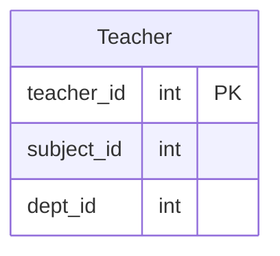

# [leetcode : 2356. Number of Unique Subjects Taught by Each Teacher](https://leetcode.com/problems/number-of-unique-subjects-taught-by-each-teacher/description/)

## **다이어그램**


## **목표**

> Write a solution to `calculate the number of unique subjects each teacher teaches in the university.`
> `각 선생님별로 가르치는 고유 과목 수 구하기`

## **문제 풀이**

### **MySQL**

[tabs: Solution 1, Solution 2]

```sql
-- SOLUTION 1: COUNT DISTINCT
SELECT teacher_id, COUNT(DISTINCT subject_id) AS cnt
FROM teacher
GROUP BY teacher_id
```

```sql
-- SOLUTION 2: COUNT DISTINCT
SELECT
    TEACHER_ID AS teacher_id,
    COUNT(DISTINCT SUBJECT_ID) AS cnt
FROM TEACHER
GROUP BY TEACHER_ID
```

[/tabs]

* SOLUTION 1, 2
  * GROUP BY + COUNT DISTINCT

### **Pandas**

[tabs: Solution 1, Solution 2]

```python
# SOLUTION 1: agg + nunique
import pandas as pd

def count_unique_subjects(teacher: pd.DataFrame) -> pd.DataFrame:
    grouped = teacher.groupby('teacher_id').agg(
        cnt = ('subject_id','nunique')
    ).reset_index()
    return grouped
```

```python
# SOLUTION 2: nunique + rename
import pandas as pd

def count_unique_subjects(teacher: pd.DataFrame) -> pd.DataFrame:
    grouped = teacher.groupby('teacher_id').nunique().reset_index().rename(columns={'subject_id':'cnt'})
    return grouped.loc[:, ['teacher_id','cnt']]
```

[/tabs]

* SOLUTION 1
  * groupby + nunique

* SOLUTION 2
  * 한 컬럼에만 집계를 해주는거라 agg 대신 nunique를 사용해서 풀이.

## **코멘트**

* 기본 문제
