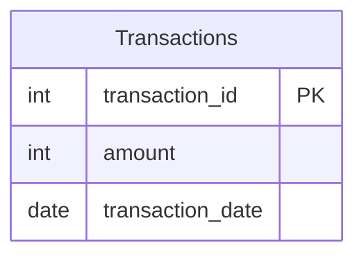

# [leetcode : 3220. Odd and Even Transactions](https://leetcode.com/problems/odd-and-even-transactions/description/)

## **다이어그램**


## **목표**

> Write a solution to `find for each date the sum of amounts for transactions where the amount is odd, and the sum of amounts for transactions where the amount is even.`
> `각 날짜별로 거래 금액이 홀수인 경우와 짝수인 경우의 합계 구하기`

## **문제 풀이**

### **MySQL**

[tabs: Solution 1, Solution 2]

```sql
-- SOLUTION 1: SUM IF
SELECT transaction_date, SUM(IF(AMOUNT%2=1,AMOUNT,0)) AS ODD_SUM, SUM(IF(AMOUNT%2=0,AMOUNT,0)) AS EVEN_SUM
FROM transactions
GROUP BY transaction_date
ORDER BY 1 ASC
```

```sql
-- SOLUTION 2: SUM IF
SELECT
    TRANSACTION_DATE,
    SUM(IF(AMOUNT%2=1,AMOUNT,0)) AS ODD_SUM,
    SUM(IF(AMOUNT%2=0,AMOUNT,0)) AS EVEN_SUM
FROM TRANSACTIONS
GROUP BY TRANSACTION_DATE
ORDER BY TRANSACTION_DATE
```

[/tabs]

* SOLUTION 1, 2
  * GROUP BY + SUM IF 사용해주기.

### **Pandas**

[tabs: Solution 1, Solution 2]

```python
# SOLUTION 1: lambda + sum
import pandas as pd

def sum_daily_odd_even(transactions: pd.DataFrame) -> pd.DataFrame:
    grouped = transactions.groupby('transaction_date').agg(
        odd_sum = ('amount', lambda group: group[group%2==1].sum()),
        even_sum = ('amount', lambda group: group[group%2==0].sum())
    ).reset_index()
    grouped.sort_values('transaction_date', inplace=True)
    return grouped
```

```python
# SOLUTION 2: 정렬 후 lambda + sum
import pandas as pd

def sum_daily_odd_even(transactions: pd.DataFrame) -> pd.DataFrame:
    transactions = transactions.sort_values('transaction_date')
    grouped = transactions.groupby('transaction_date').agg(
        odd_sum = ('amount', lambda group: group[group%2==1].sum()),
        even_sum = ('amount', lambda group: group[group%2==0].sum())
    ).reset_index()
    return grouped
```

[/tabs]

* SOLUTION 1
  * group by + lambda sum
  * groupby 이후 lambda로 받는 객체가 Series라 group으로 표현하는게 더 좋은 것 같다.
  * apply 시 lambda로 받을 때는 row가 들어오므로 x대신 row로 표현하는 습관 들이기.

* SOLUTION 2
  * 비슷하게 풀었는데, 미리 transactions를 정렬을 시킨다.
  * 데이터프레임에서 순서도 유지시켜줄 것 같았는데 순서도 유지시켜줬다.
  * 정렬되어있는 DataFrame에서 agg 속도가 더 빠를거같았는데, 예상대로 더 빠르게 동작한다.

## **코멘트**

* 기본 문제
