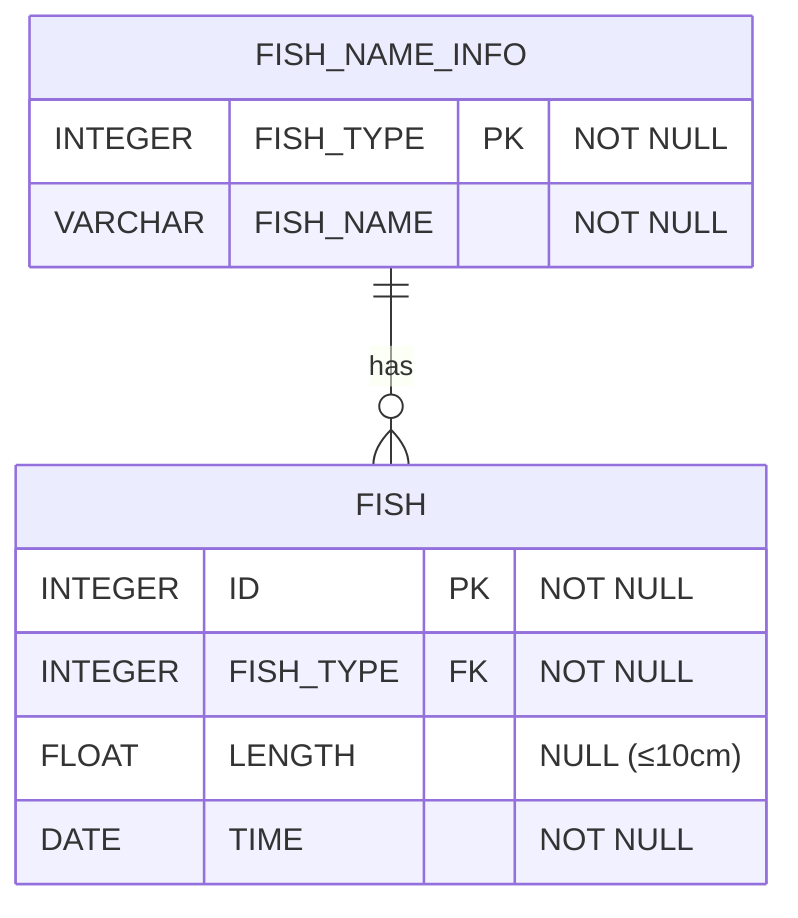

# [programmers : 물고기 종류 별 잡은 수 구하기](https://school.programmers.co.kr/learn/courses/30/lessons/293257)

## **다이어그램**



## **목표**

> FISH_NAME_INFO에서 물고기의 종류 별 물고기의 이름과 잡은 수를 출력하는 SQL문을 작성해주세요.
> 물고기의 이름 컬럼명은 FISH_NAME, 잡은 수 컬럼명은 FISH_COUNT로 해주세요.
> 결과는 잡은 수 기준으로 내림차순 정렬해주세요.

## **문제 풀이**

### **MySQL**

[tabs: Solution 1]

```sql
-- SOLUTION 1
SELECT COUNT(*) AS FISH_COUNT, N.FISH_NAME
FROM FISH_INFO AS I
JOIN FISH_NAME_INFO AS N ON I.FISH_TYPE = N.FISH_TYPE
GROUP BY N.FISH_NAME
ORDER BY COUNT(*) DESC
```

[/tabs]

* SOLUTION 1
  * join 이후 group by

## **코멘트**

* COUNT(*)과 COUNT(COL)의 차이를 이해하기
