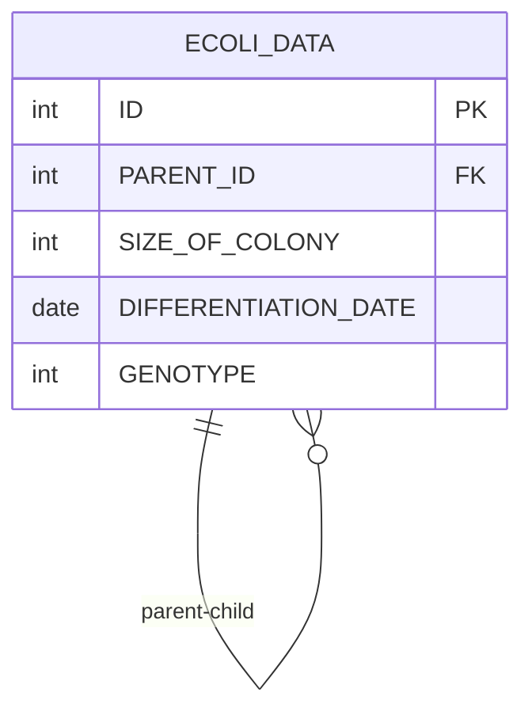

# [programmers : 부모의 형질을 모두 가지는 대장균 찾기](https://school.programmers.co.kr/learn/courses/30/lessons/301647)

## **다이어그램**



## **목표**

> 부모의 형질을 모두 가지는 대장균의 ID, GENOTYPE, PARENT_GENOTYPE을 출력하는 SQL 문을 작성해주세요. 이때 결과는 대장균의 ID 에 대해 오름차순 정렬해주세요.

## **문제 풀이**

### **MySQL**

[tabs: Solution 1]

```sql
-- SOLUTION 1
SELECT E2.ID, E2.GENOTYPE, E1.GENOTYPE AS PARENT_GENOTYPE
FROM ECOLI_DATA E1
JOIN ECOLI_DATA E2 ON E1.ID = E2.PARENT_ID
WHERE (E1.GENOTYPE & E2.GENOTYPE) = E1.GENOTYPE
ORDER BY E2.ID
```

[/tabs]

* SOLUTION 1
  * 한쪽은 Id를 바탕으로, 한 쪽은 PARENT ID를 바탕으로 조인.
  * 비트연산 후에 부모의 ID랑 똑같이 나오면 된다.

## **코멘트**

* 비트연산도 안나올거같음
