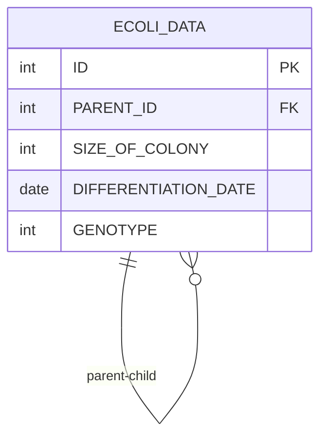

# [programmers : 분기별 분화된 대장균의 개체 수 구하기](https://school.programmers.co.kr/learn/courses/30/lessons/299308)

## **다이어그램**



## **목표**

> 각 분기(QUARTER)별 분화된 대장균의 개체의 총 수(ECOLI_COUNT)를 출력하는 SQL 문을 작성해주세요. 이때 각 분기에는 'Q' 를 붙이고 분기에 대해 오름차순으로 정렬해주세요. 대장균 개체가 분화되지 않은 분기는 없습니다.

## **문제 풀이**

### **MySQL**

[tabs: Solution 1]

```sql
-- SOLUTION 1
WITH QUARTERED AS (
    SELECT
        CASE
            WHEN MONTH(DIFFERENTIATION_DATE) <= 3 THEN '1Q'
            WHEN MONTH(DIFFERENTIATION_DATE) <= 6 THEN '2Q'
            WHEN MONTH(DIFFERENTIATION_DATE) <= 9 THEN '3Q'
            ELSE '4Q'
        END AS QUARTER
    FROM ECOLI_DATA
)

SELECT
    QUARTER,
    COUNT(*) AS ECOLI_COUNT
FROM QUARTERED
GROUP BY QUARTER
ORDER BY QUARTER
```

[/tabs]

* SOLUTION 1
  * 다중 분기라서 IF 대신 CASE WHEN으로 풀이

## **코멘트**

* .
