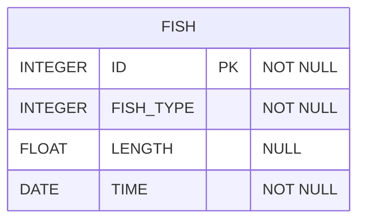

# [programmers : 잔챙이 잡은 수 구하기](https://school.programmers.co.kr/learn/courses/30/lessons/293258)

## **다이어그램**



## **목표**

> 잡은 물고기 중 길이가 10cm 이하인 물고기의 수를 출력하는 SQL 문을 작성해주세요.
> 물고기의 수를 나타내는 컬럼 명은 FISH_COUNT로 해주세요.

## **문제 풀이**

### **MySQL**

[tabs: Solution 1]

```sql
-- SOLUTION 1
SELECT COUNT(*) AS FISH_COUNT
FROM FISH_INFO
WHERE LENGTH IS NULL
```

[/tabs]

* SOLUTION 1
  * null 처리

## **코멘트**

* null 처리
