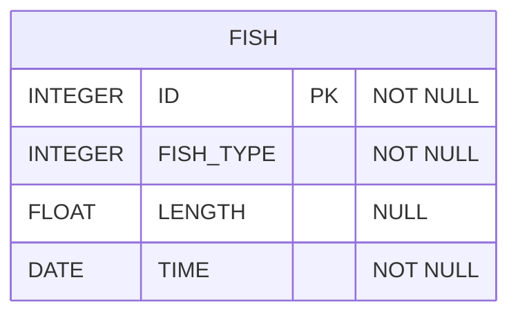

# [programmers : 잡은 물고기의 평균 길이 구하기](https://school.programmers.co.kr/learn/courses/30/lessons/293259)

## **다이어그램**



## **목표**

> 잡은 물고기의 평균 길이를 출력하는 SQL문을 작성해주세요.
> 평균 길이를 나타내는 컬럼 명은 AVERAGE_LENGTH로 해주세요.
> 평균 길이는 소수점 3째자리에서 반올림하며, 10cm 이하의 물고기들은 10cm 로 취급하여 평균 길이를 구해주세요.

## **문제 풀이**

### **MySQL**

[tabs: Solution 1]

```sql
-- SOLUTION 1
SELECT ROUND(AVG(COALESCE(LENGTH,10)),2) AS AVERAGE_LENGTH
FROM FISH_INFO
```

[/tabs]

* SOLUTION 1
  * null 처리 -> COALESCE로 한 번에 처리하기
  * 나눠서 할거면 COALESCE나 IF로 SUBQUERY나 CTE에서 한 번 처리를 하고, 메인 쿼리에서 집계하기

## **코멘트**

* null 처리 -> COALESCE로 한 번에 처리하기
* 나눠서 할거면 COALESCE나 IF로 SUBQUERY나 CTE에서 한 번 처리를 하고, 메인 쿼리에서 집계하기
