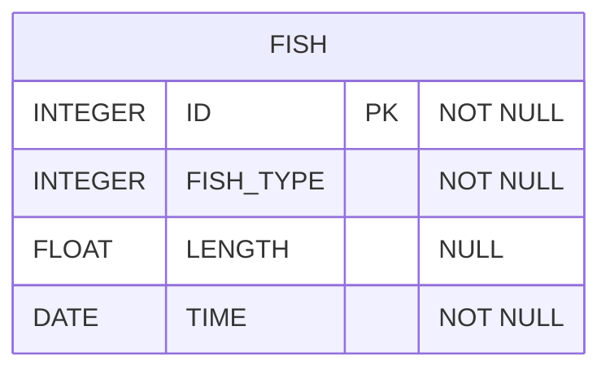

# [programmers : 잡은 물고기 중 가장 큰 물고기의 길이 구하기](https://school.programmers.co.kr/learn/courses/30/lessons/298515)

## **다이어그램**



## **목표**

> FISH_INFO 테이블에서 잡은 물고기 중 가장 큰 물고기의 길이를 'cm' 를 붙여 출력하는 SQL 문을 작성해주세요.
> 이 때 컬럼명은 'MAX_LENGTH' 로 지정해주세요.

## **문제 풀이**

### **MySQL**

[tabs: Solution 1, Solution 2]

```sql
-- SOLUTION 1
SELECT DISTINCT CONCAT(LENGTH,"cm") AS MAX_LENGTH
FROM FISH_INFO
WHERE LENGTH = (SELECT MAX(LENGTH) FROM FISH_INFO)
```

```sql
-- SOLUTION 2
SELECT CONCAT(LENGTH,"cm") AS MAX_LENGTH
FROM FISH_INFO
ORDER BY LENGTH DESC
LIMIT 1
```

[/tabs]

* SOLUTION 1
  * 서브쿼리 사용해서 풀어주기.
  * WHERE + SUBQUERY에서 MAX값이 여러 개 인 경우, 다중 행을 반환할 가능성이 있어서 SELECT 절에서 DISTINCT를 사용한다.

* SOLUTION 2
  * ORDER BY로 정렬 이후, LIMIT로 상위 1개를 가져와주면 된다.

## **코멘트**

* .
