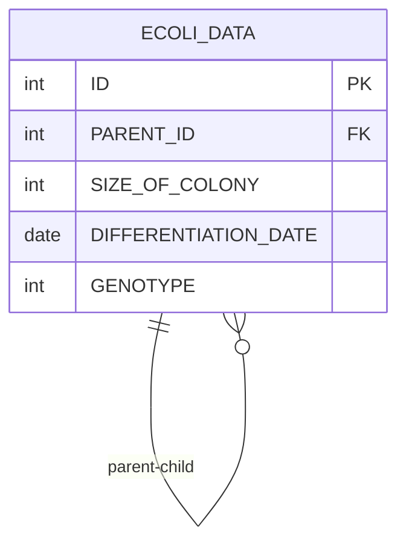

# [programmers : 특정 세대의 대장균 찾기](https://school.programmers.co.kr/learn/courses/30/lessons/301650)

## **다이어그램**



## **목표**

> 3세대의 대장균의 ID(ID) 를 출력하는 SQL 문을 작성해주세요. 이때 결과는 대장균의 ID 에 대해 오름차순 정렬해주세요.

## **문제 풀이**

### **MySQL**

[tabs: Solution 1]

```sql
-- SOLUTION 1
WITH RECURSIVE GENERATION AS (
    SELECT ID, PARENT_ID, 1 AS GEN
    FROM ECOLI_DATA
    WHERE PARENT_ID IS NULL

    UNION ALL
    SELECT E.ID, E.PARENT_ID, G.GEN + 1 AS GEN
    FROM ECOLI_DATA E
    JOIN GENERATION G ON E.PARENT_ID = G.ID
)

SELECT ID
FROM GENERATION
WHERE GEN = 3
ORDER BY ID
```

[/tabs]

* SOLUTION 1
  * 각 세대를 찾기 위해 RECURSIVE CTE를 사용한다.
  * 첫 CTE 내부 쿼리에서는 초기값을 할당하고, 그 이후로는 UNION ALL로 테이블을 계속 병합
  * 세대를 구했으면 단순 WHERE + ORDER BY

## **코멘트**

* RECURSIVE는 안나올거같음
