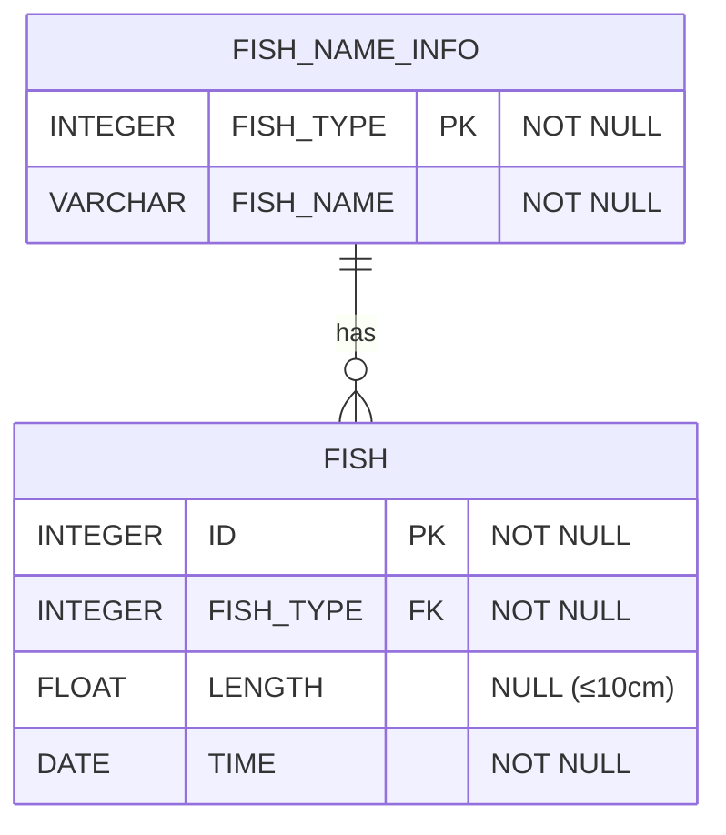

# [programmers : 특정 물고기를 잡은 총 수 구하기](https://school.programmers.co.kr/learn/courses/30/lessons/298518)

## **다이어그램**



## **목표**

> FISH_INFO 테이블에서 잡은 BASS와 SNAPPER의 수를 출력하는 SQL 문을 작성해주세요.
> 컬럼명은 'FISH_COUNT`로 해주세요.

## **문제 풀이**

### **MySQL**

[tabs: Solution 1]

```sql
-- SOLUTION 1
SELECT COUNT(*) AS FISH_COUNT
FROM FISH_INFO AS I
JOIN FISH_NAME_INFO AS N ON I.FISH_TYPE = N.FISH_TYPE
WHERE N.FISH_NAME IN ("BASS",'SNAPPER')
```

[/tabs]

* SOLUTION 1
  * 공통 컬럼으로 JOIN 이후에 WHERE 조건

## **코멘트**

* .
