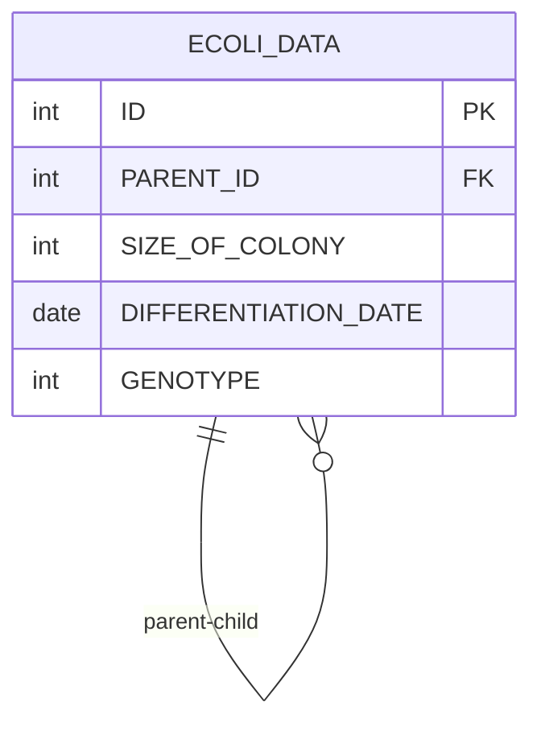

# [programmers : 특정 형질을 가지는 대장균 찾기](https://school.programmers.co.kr/learn/courses/30/lessons/301646)

## **다이어그램**



## **목표**

> 2번 형질이 보유하지 않으면서 1번이나 3번 형질을 보유하고 있는 대장균 개체의 수(COUNT)를 출력하는 SQL 문을 작성해주세요. 1번과 3번 형질을 모두 보유하고 있는 경우도 1번이나 3번 형질을 보유하고 있는 경우에 포함합니다.

## **문제 풀이**

### **MySQL**

[tabs: Solution 1]

```sql
-- SOLUTION 1
SELECT COUNT(*) AS `COUNT`
FROM ECOLI_DATA
WHERE (GENOTYPE & 4 = 4 OR GENOTYPE & 1 = 1) AND GENOTYPE & 2 = 0
```

[/tabs]

* SOLUTION 1
  * 비트연산으로 체크해주기.
  * 자리수에서 T/F로 체크하는게 아니라 해당 값을 구하는 방식으로 접근
  * 혹은 bit shift로 계산하기

## **코멘트**

* .
