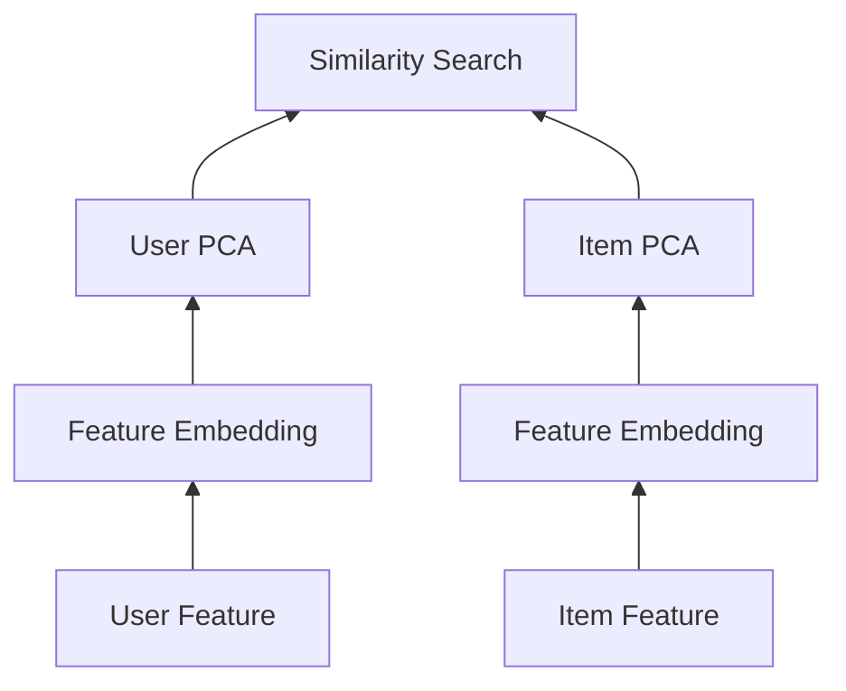
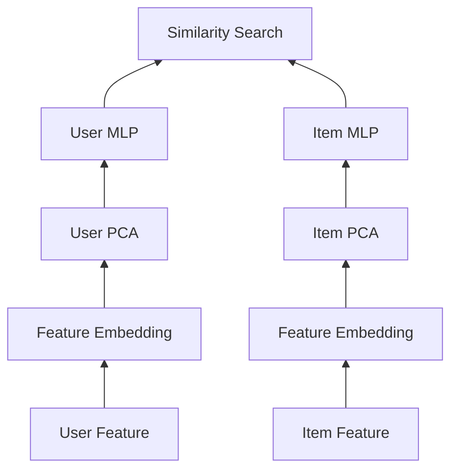
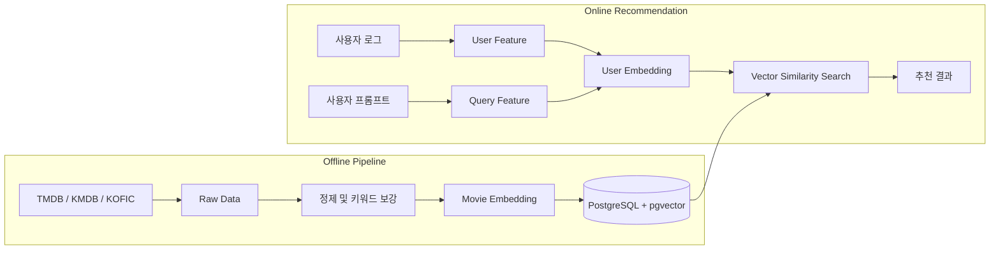
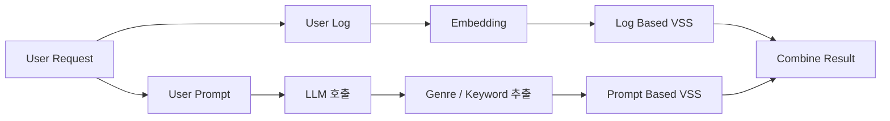
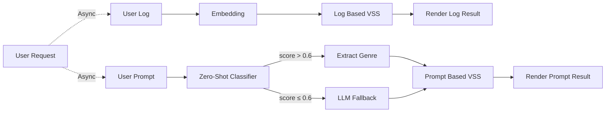

# [모하시네마] 2. 영화 추천 서비스 - 추천 시스템 운영

[모하시네마 1편: Vector DB 및 추천 시스템 아키텍처 설계](/posts/projects/movie-recommendation-1)에서 작성한 영화 데이터 수집, VectorDB 선택, 임베딩 모델 선택 및 데이터 임베딩에서 발생하는 문제 해결에 이어서 추천 시스템 아키텍처 구성 및 실운영 문제 해결에 대해서 진행해보겠습니다.

## 1. 추천 시스템 아키텍처

추천 시스템에서는 영화를 바탕으로 연관 영화를 찾는 Item-Item, 유저의 정보 또는 쿼리를 바탕으로 영화를 찾는 User-Item의 두 가지 형태가 존재합니다. 이를 Two-Tower 구조로 구현하여 User Feature와 Item Feature를 각각 처리했습니다.

### 1-1. Two-Tower Architecture

:::diagram-grid
#### Before: MLP 적용 전



#### After: MLP 적용 후


:::

초기 아키텍처인 Before의 `Two Tower Architecture`에서는 User Feature와 Item Feature는 형태가 다르기 때문에 User-Item 검색 시 원하는 결과를 찾지 못하는 문제가 발생했습니다. 즉, 같은 차원에 놓여있어도 벡터 공간에서 위치가 다르면 유사도 검색 시 성능이 떨어질 수 있습니다.

이를 해결하기 위해 각 Tower의 출력을 동일한 벡터 공간에 정렬시키는 작업이 필요했습니다. User MLP와 Item MLP를 각 Tower 끝에 추가하고, 실제 (User, Item) 상호작용 데이터를 활용한 Contrastive Loss로 두 Tower를 함께 학습시켜, User 벡터와 Item 벡터가 동일한 Semantic Space에 놓이도록 했습니다.

### 1-2. Cold Start 문제

서비스 초기 또는 신규 가입 유저의 경우, 별점이나 찜 같은 행동 데이터가 전혀 없어 User Tower에 입력할 Feature 자체가 존재하지 않는 Cold Start 문제가 발생했습니다. 행동 데이터가 없는 상태에서는 Two-Tower 구조상 User 벡터를 의미 있게 생성할 수 없었습니다.

이를 해결하기 위해 가입 시점에 취향 검사(온보딩)를 도입해, 선호 장르/영화를 직접 선택하도록 했습니다. 이렇게 수집한 초기 선호 정보와 이후의 찜 데이터를 활용해 행동 로그가 부족한 신규 유저에게도 User Feature를 구성할 수 있도록 했습니다.


온보딩(취향 검사): 가입 직후 선호 장르/영화 선택 → 초기 User Feature 확보
찜: 이후 행동 데이터를 지속적으로 반영해 User Feature 갱신
별점: 충분히 쌓이면 이후 학습(BPR)의 Positive/Negative 라벨로 활용

즉, 온보딩과 찜은 Cold Start 구간의 임시 Feature 확보 수단으로, 별점은 Tower를 정렬시키는 학습 신호로 역할을 분리해 설계했습니다.

### 1-3. BPR Loss를 통한 Tower 정렬

Two-Tower를 학습시킬 때는 User Tower와 Item Tower를 독립적으로 학습시키지 않고, 하나의 Loss로 묶어 동시에 학습시켰습니다.

유저의 별점 데이터를 기준으로 Positive/Negative를 구성했습니다. 3점 이상은 Positive, 3점 미만은 Negative로 라벨링했습니다.

```text
User Feature → User MLP → u (벡터)
Item Feature(평점 >= 3)  → Item MLP → v_pos
Item Feature(평점 < 3)  → Item MLP → v_neg

score_pos = dot(u, v_pos)
score_neg = dot(u, v_neg)
loss = -log(sigmoid(score_pos - score_neg))
```

BPR은 절대적인 점수를 맞추는 것이 아니라 "Positive가 Negative보다 높은 점수를 받아야 한다"는 상대적 순서를 학습합니다. 별점처럼 선호/비선호가 명확하게 갈리는 데이터에서는 절대값 예측보다 상대적 랭킹 학습 방식이 더 적합했습니다.

이 Loss를 역전파하면 gradient가 User MLP와 Item MLP 양쪽으로 전달되어, 두 Tower가 서로 다른 파라미터를 가지면서도 출력 벡터는 같은 Semantic Space로 수렴하도록 학습됩니다.

이러한 과정을 통해서 User-Item간 검색이 제대로 동작하지 않는 문제를 해결할 수 있었습니다.

---

## 2. 실시간 서비스 운영

벡터 유사도 검색 정확도를 높이기 위해 앞서 진행했던 Embedding Process 개선, Two Tower Architecture 개선 등의 방법을 진행했습니다. 이외에도, 실시간 서비스 운영 중 발생한 문제들을 해결하기 위해 다양한 최적화 작업을 수행했습니다. 발생한 추가적인 문제는 다음과 같습니다.

* CPU 부하
* 자연어 기반 실시간 추천 서비스 API 지연

### 2-1. CPU 부하 줄이기

하나의 인스턴스에서 개발 서버, 운영 서버와 더불어 Hugging Face 모델까지 서빙을 하다보니 CPU 부하가 발생했습니다. 실시간 요청이 들어올 때 마다, CPU 사용량이 100%를 훨씬 웃도는 수치를 보여주었습니다. 이를 해결하기 위해 Vector Size를 줄이는 방식을 선택했습니다.

CPU 부하의 원인을 분석해본 결과, e5-small 모델의 실시간 추론(Forward Pass) 자체는 구조상 줄이기 어려운 반면, 이후 단계인 PCA 차원과 pgvector에서의 벡터 유사도 연산량은 임베딩 차원에 비례해 늘어난다는 점에 주목했습니다. 특히 싱글 코어 환경에서는 벡터 차원이 커질수록 dot product 연산 비용이 누적되어 CPU 부하에 직접적인 영향을 주고 있었습니다.

이에 따라 임베딩 차원을 줄이는 방향으로 최적화를 진행했습니다. 정식 부하테스트 도구 대신, EC2 단일 인스턴스 환경에서 Dozzle로 컨테이너 리소스를 모니터링하며 반복 요청 테스트를 통해 차원별 CPU 사용률과 추천 성능(Recall@10)을 비교했습니다.

|Dimension|Variance Explained|CPU Resource|Recall@10|
|---|---|---|---|
|256|0.89|110%|0.7|
|128|0.71|79%|0.7|
|64|0.51|64%|0.5|

256차원 대비 128차원은 CPU 사용률을 약 28% 절감하면서도 Recall@10은 0.7로 동일하게 유지되었습니다. 반면 64차원까지 줄이면 CPU는 더 낮아지지만 Recall@10이 0.5로 크게 하락해, 성능 손실이 리소스 절감 폭보다 커진다고 판단했습니다.

이를 바탕으로 128차원을 최종 벡터 크기로 선택해, Recall 손실 없이 싱글 코어 환경에서도 안정적으로 서비스가 동작할 수 있도록 최적화했습니다.

### 2-2. 추천 API 응답 지연 개선



추천 시스템은 데이터 수집과 영화 벡터 생성이 이루어지는 오프라인 영역, 사용자 요청을 받아 추천 결과를 반환하는 온라인 영역으로 구분됩니다.

온라인 영역인 추천 API는 유저의 프롬프트를 LLM을 사용하여 한 번 정제를 하는 과정을 거치고 있습니다. 이 때문에 LLM API 호출 시 평균 약 3초의 latency와 LLM 호출 비용이 발생했습니다. 또한, 영화 호출 API에서 User Log VSS와 User Prompt VSS Flow 두 Flow가 동시에 수행되어 User Log VSS 의 경우 Prompt 호출이 없어도 다른 Flow의 대기 시간을 함께 기다려야 했습니다.

1. `User Log VSS`: 사용자 평가와 선호 정보를 바탕으로 한 추천
2. `User Prompt VSS`: 자연어 프롬프트를 바탕으로 한 추천


:::diagram-grid stacked
#### Before: 동기 처리 및 LLM 선행 호출



#### After: 비동기 분리 및 Zero-Shot 우선 처리


:::

LLM 호출을 줄이기 위해 `Sentence Transformer`를 이용한 Zero-Shot 분류를 먼저 수행했습니다. 미리 정의한 장르 벡터와 사용자 질의 벡터의 유사도를 비교하고, 임계값을 넘은 경우 Top-K 방식으로 최대 3개의 장르를 추출했습니다. 분류 점수가 임계값보다 낮은 경우에만 LLM을 호출하는 fallback 로직을 남겨두고, 로그 기반 추천 API와 프롬프트 기반 추천 API를 분리해 화면에서 비동기로 호출했습니다. 화면이 세로로 긴 것을 감안하여 응답 시간이 긴 API를 보이지 않는 곳에 배치하여 사용자 경험을 개선했습니다.


측정 결과 평균 응답 시간은 6.596초에서 5.109초로 약 1.5초 감소했습니다.

| API | Version | 평균 응답 시간(초) | 표준 편차(초) | 샘플 수 |
| --- | --- | ---: | ---: | ---: |
| user_chemistry | old | 6.596 | 1.560 | 92 |
| user_chemistry | new | **5.109** | 1.793 | 78 |

LLM 호출 대신 Sentence Transformer를 우선 사용하면서 평균 응답 시간을 약 22.54% 개선했습니다.

---

## 3. PostgreSQL 조회 및 벡터 검색 최적화

### 3-1. 배열 컬럼 조회와 GIN Index

`Genres`, `Keywords` 컬럼은 `text[]` 타입으로 저장했습니다. 배열 내부의 특정 값을 조건으로 검색할 때 인덱스가 없으면 Full Scan이 발생할 수 있어, 향후 데이터 규모 증가를 고려해 `GIN Index`를 적용했습니다.

```sql
WHERE 'SF' = ANY(genres)
   OR keywords @> ARRAY['우주']
```

장르는 약 19개로 값의 종류가 적어 인덱스 효과가 크지 않을 수 있지만, 키워드는 값의 종류가 훨씬 많아 필터링 조건으로 자주 사용될 경우 인덱스 효과를 기대할 수 있다고 판단했습니다. (현재 데이터 규모에서 GIN 적용 전후 성능을 정량적으로 비교하지는 않았습니다.)

### 3-2. 필터링 이후 Vector Similarity Search

전체 데이터에 벡터 거리 계산을 수행하면 연산량이 커지기 때문에 장르나 키워드와 같이 비교적 비용이 낮은 조건으로 후보를 줄인 뒤, 해당 결과에 대해 Vector Similarity Search를 수행하는 구조를 사용했습니다.

```sql
SELECT
    id,
    title,
    embedding <-> query_vector AS distance
FROM movies
WHERE genres && ARRAY['판타지', '액션']
  AND embedding <-> query_vector < 0.7
ORDER BY embedding <-> query_vector
LIMIT 10;
```

필요한 경우 Subquery 또는 CTE로 후보군을 먼저 구성하는 방식도 검토했습니다.

```sql
SELECT
    id,
    title,
    embedding <-> query_vector AS distance
FROM (
    SELECT *
    FROM movies
    WHERE genres && ARRAY['판타지', '액션']
) AS filtered_movies
WHERE embedding <-> query_vector < 0.7
ORDER BY embedding <-> query_vector
LIMIT 10;
```

### 3-3. Vector Index가 필요한가

서비스에서 검색하는 영화는 약 2만 건이었기 때문에 Full Scan 기반 검색으로도 실시간 응답이 가능했습니다. 장르와 개봉 연도 등으로 후보군을 먼저 줄이는 경우에는 검색 대상이 수백 또는 수천 건 수준까지 작아져, ANN Index 없이도 충분한 응답 속도를 보였습니다.

다만 향후 데이터 규모가 커질 경우를 대비해 HNSW, IVF 등 ANN Index 방식을 사전에 검토했습니다. 현재 규모에서는 바로 도입하지 않고, 데이터 증가와 API 응답 시간을 관찰하며 필요 시점에 도입하는 방향으로 정리했습니다.

| 방식 | 탐색 특징 | 정확도 | 메모리 | 적합한 상황 |
| --- | --- | --- | --- | --- |
| Flat | 전체 벡터 비교 | 높음 | 낮음 | 소규모 데이터, 정확한 검색 |
| HNSW | 그래프 기반 근사 탐색 | 높음 | 높음 | 실시간 대규모 검색 |
| IVF Flat | Cluster 기반 후보 탐색 | 중간~높음 | 중간 | 중간 규모 데이터 |
| IVF PQ | Cluster와 벡터 압축 | 상대적으로 낮음 | 낮음 | 초대규모 또는 메모리 제약 환경 |

---

## 4. 마무리

추천 시스템을 설계하는 것과 제한된 환경에서 실제로 운영하는 것은 다른 문제였습니다. 데이터가 충분히 수집됐더라도 결측과 품질을 확인하지 않으면 임베딩 결과를 신뢰하기 어려웠고, 모델이 동작하더라도 LLM 지연이나 CPU 부하로 사용자 경험이 나빠질 수 있었습니다.

짧은 시간안에 프로젝트를 완수하기 바빠서 사실 엄밀하게 진행한 부분이 적어서 아쉬운 부분이 많았습니다. 특히, 기술 선택 측면에 있어서도 짧은 시간안에 선택지를 효율적으로 비교할 시간이 적어서 레퍼런스 위주로 진행했던 부분이 아쉽습니다. 또한, 프로젝트 개선에도 엄밀한 데이터를 기반으로 하는 것이 아니라 러프한 데이터와 체감으로 비교한 부분이 많아 아쉬웠습니다. 추후 다른 프로젝트에 이러한 문제점이 발생하게 된다면 더 좋은 방식으로 개선하고 싶습니다.

---

## 레퍼런스

[실시간 반응형 추천 개발 일지 1부: 프로젝트 소개](https://techblog.woowahan.com/17383/)
[실시간 반응형 추천 개발 일지 2부: 벡터 검색, 그리고 숨겨진 요구사항과 기술 도입 의사 결정을 다루는 방법](https://techblog.woowahan.com/21027/)

## 관련 포스팅

👈 [모하시네마 1편: Vector DB 및 추천 시스템 아키텍처 설계](/posts/projects/movie-recommendation-1)
