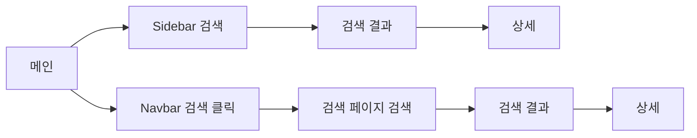

# [던통: 검색 접근성 개선 A/B 테스트] 1. 문제 정의와 설계

## 1. 개요

게임 통계 제공 서비스 [던통](https://duntong.xyz/) 프로젝트를 진행하며 초기 프로젝트 단계에서 주변인들에게 사이트에 대한 의견을 물어보고 이벤트 로깅 분석을 통해 개선점이 있다는 것을 확인하게 되었습니다.

비록 테스트 단계라서 많은 데이터를 수집하지 못했지만, 이러한 데이터를 바탕으로 분석을 진행하고 실험을 설계하여 프로덕트를 개선하는 과정을 경험하고자 `검색 접근성 개선 A/B 테스트` 프로젝트를 진행하게 되었습니다.

---

## 2. 문제 정의

주변인들의 피드백은 다음과 같았습니다. '메인 화면이 너무 복잡하다', '캐릭터 검색을 위한 검색 접근성이 좋지 않다' 등이 있었습니다. 초기 MVP인 캐릭터 및 모험단 상세 페이지에서 통계 정보를 제공해야 하지만, 검색 접근성이 떨어져 상세 페이지로 이동이 어려웠습니다.

| Before | After |
| :---: | :---: |
|  |  |

좌측 이미지는 던통 프로젝트 초기의 메인 화면이고, 우측 이미지는 검색 컴포넌트를 추가한 메인 화면입니다.

Before 사진의 경우, 검색을 진행하려면 좌측 상단에 존재하는 `Sidebar`에 있는 검색을 이용하거나 상단 `NavBar`의 검색을 클릭하여 검색 페이지로 이동 후 검색을 이용해야 했습니다.

이를 해결하기 위해, 다른 비슷한 사이트들처럼 메인 화면에 검색 컴포넌트를 추가하여 사용자의 검색 접근성을 높여서 상세 페이지로 쉽게 이동할 수 있도록 프로덕트를 개선하기로 했습니다.

위 사진처럼 메인 화면에 신규 검색 컴포넌트를 추가하여 검색 진입 경로를 늘리고, 상세 페이지 전환율을 높이고자 했습니다.

실사용자 로그만으로는 A/B 테스트에 필요한 표본을 확보하기 어려웠습니다. 따라서 기존 로그의 전체 퍼널 규모를 유지하고, 이벤트 계약에 맞춰 검색 진입 경로를 분리한 모의 데이터를 구성하여 실험 설계와 분석 과정을 검증했습니다.

## 3. 문제 분석

웹 이벤트 로깅 데이터를 바탕으로 퍼널 분석을 진행하여 문제 상황을 확인했습니다.

### 3-1. 이벤트 로깅

Svelte에서 직접 이벤트를 로깅하여 FastAPI 서버로 전송 후 BigQuery에 저장하는 방식으로 로그 데이터를 수집했습니다.

* user_id: 브라우저 기반 익명 사용자 ID (UUID)
* session_id: 세션 ID
* timestamp: 이벤트 발생 시간
* page_path: 페이지 경로
* variant: A/B 테스트 실험·대조군
* source: 이벤트 발생 소스
* page_view: 홈·검색·상세 페이지 진입
* searchbar_focus: 검색창 포커스 (검색 시작 의도 포착)
* searchbar_submit: 검색 실행
* nav_item_click: 검색 메뉴 클릭
* search_result_view / adventure_search_result_view: 검색 결과 노출 (캐릭터/모험단)
* character_card_click / adventure_stats_button_click: 상세 페이지 진입 직전 클릭
* page_dwell_end: 페이지 체류 종료, bounce 여부 판단
* search_error: 검색 실행 중 오류

처음 이벤트 설계를 할 때는 page_view, searchbar_submit 정도만 있으면 충분하다고 생각했습니다. 하지만 "검색을 시작했는가"와 "검색을 완료했는가"를 구분하지 못하면, 이후 실험에서 접근성 문제와 검색 품질 문제를 분리할 수 없었습니다. 또한 검색 품질도 상세 페이지 전환에 영향을 주기 때문에 검색 관련 이벤트를 세분화했습니다.

메인 화면 UI 변경으로 이탈이 증가할 가능성도 확인하기 위해 페이지 체류 종료와 bounce 여부를 함께 수집했습니다.

### 3-2. 퍼널 분석

홈 진입을 시작점으로 고정한 `closed funnel`로 30분 이내 이벤트를 연결했습니다. Sidebar와 Navbar는 서로 다른 검색 진입 경로로 구분했습니다.

| 경로 | 검색 시작 | 검색 결과 | 상세 진입 | 검색 시작률(홈 세션 대비) |
| --- | ---: | ---: | ---: | ---: |
| Sidebar | 192세션 | 154세션 | 106세션 | 8.99% |
| Navbar | 449세션 | 361세션 | 210세션 | 21.02% |
| 합계 | 641세션 | 515세션 | 316세션 | 30.01% |

전체 검색 시작과 상세 진입 합계는 기존 로그를 기준으로 유지하고, Sidebar와 Navbar의 세부 경로는 이벤트 계약과 UI 흐름을 반영해 모의 데이터에서 분리했습니다.

**경로별 전환율**

| 경로 | 검색 시작 세션 | 상세 진입 세션 | 검색→상세 전환율 |
| --- | ---: | ---: | ---: |
| Sidebar | 192세션 | 106세션 | 55.21% |
| Navbar (검색 페이지에서 재검색) | 449세션 | 210세션 | 46.77% |

- 홈에서 검색을 시작한 세션은 30.01%(641세션), 검색을 시작하지 않은 세션은 69.99%(1,495세션)
- Sidebar는 세션 수는 적지만 검색 → 상세 페이지 전환율이 Navbar보다 높았습니다. 검색 페이지 이동과 재검색 단계가 없기 때문으로 해석했습니다.
- 반대로 Navbar는 검색 페이지로 한 번 이동하는 단계가 추가되어 전환율이 상대적으로 낮다고 판단했습니다.

여기서 눈에 띄는 지점은 검색을 시작한 세션의 절반 정도가 상세 페이지까지 도달한다는 것이었습니다. 반면 홈 세션 중 검색을 시작하는 비율은 30%에 그쳤습니다.

검색 품질 저하 여부를 확인하기 위해 Zero Result Rate와 Search Error Rate를 Guardrail로 설정했습니다.
  
| 지표 | 값 (baseline) |
| --- | --- |
| Zero Result Rate | 17.7% |
| Search Error Rate | 2.2% |

## 4. 실험 설계

### 4-1. 가설 설정

Variant A: 기존 검색 진입 방식 유지
Variant B: 메인 화면에 Hero Search Bar를 노출하여 검색 접근성 개선

| 구분 | 가설 |
| --- | --- |
| H0 | Variant B의 Home → Detail CVR은 Variant A보다 높지 않다. |
| H1 | 메인 화면에 Hero Search Bar를 노출한 Variant B는 Variant A 대비 Home → Detail CVR을 높인다. |

이 실험을 통해 검증하려는 것은 검색 진입의 문턱을 줄이는 것입니다. 따라서 전체 검색 진입률과 Hero·Sidebar·Navbar별 진입률을 함께 확인하여 전환율 상승 원인과 기존 경로의 카니발라이제이션을 분석했습니다.

### 4-2. 실험 구조

|항목|정의|
| --- | --- |
| 실험 키 | search_funnel_v1 |
| 할당 단위 | user_uuid (동일 유저는 항상 동일 variant) |
| 실험 기간 | 2주 |
| 집계 기준 | KST |

로그인 기반 식별 기능이 없어 브라우저에 저장된 user_uuid를 할당 단위로 사용했습니다. user_uuid와 실험 키를 해싱해 A/B 그룹을 고정하고, 할당 결과를 로컬 스토리지에 저장하여 세션이 변경되어도 동일한 Variant가 노출되도록 했습니다. 다만 브라우저나 기기가 변경되면 동일 사용자를 식별할 수 없다는 한계가 있습니다.
  
### 4-3. 지표 설정

| 구분 | 지표 | 정의 |
| --- | --- | --- |
| Primary | 홈 화면 → 상세 페이지 전환율 | 홈 진입 후 30분 이내 같은 세션에서 상세 페이지에 도달한 비율 |
| Secondary | Home Search Entry Rate | 홈 세션 중 검색을 시작한 비율 |
| Secondary | 경로별 검색 진입률 | Hero·Sidebar·Navbar별 검색 진입률로 카니발라이제이션 확인 |
| Secondary | Submit → Detail CVR | 검색 실행 후 상세 페이지에 도달한 비율 |
| Guardrail | Zero Result Rate | 검색 결과 노출 중 결과가 없는 비율 |
| Guardrail | Search Error Rate | 검색 실행 대비 오류가 발생한 비율 |
| Guardrail | Home Bounce Rate | 홈의 `page_dwell_end` 이벤트 중 `is_bounce=true`인 비율 |
 
### 4-4. 표본 설계

Baseline의 Home → Detail CVR은 약 15%였습니다. 15%에서 20%로의 5%p 개선을 검출 목표로 두고 유의수준 5%, 검정력 80%, A/B 1:1 배정을 가정했습니다. 단측 Two-proportion z-test 기준 필요한 표본은 Variant당 약 714개였으며, 2주 동안 Variant당 약 1,050개의 홈 세션을 확보하는 것으로 설계했습니다.

| 항목 | 설정 |
| --- | --- |
| Baseline CVR | 약 15% |
| 목표 CVR | 약 20% |
| 목표 개선 폭 | +5%p |
| 유의수준 | 0.05 |
| 검정력 | 0.80 |
| 검정 방식 | Two-proportion z-test, 단측 |
| 필요 표본 | Variant당 약 714 홈 세션 |
| 예상 표본 | Variant당 약 1,050 홈 세션 |
| 실험 기간 | 2주 |
   
### 4-5. 분석 방법

Primary 지표인 Home → Detail CVR은 두 Variant의 전환율을 비교하는 Two-proportion z-test로 검정했습니다. 실험 가설을 Variant B의 전환율이 Variant A보다 높다로 사전에 설정했기 때문에 단측 검정을 사용했으며, 유의수준은 5%로 설정했습니다.

- H0: Variant B의 전환율은 Variant A보다 높지 않다.
- H1: Variant B의 전환율은 Variant A보다 높다.

| 구분 | 설명 |
| --- | --- |
| Ship (B안 채택) | P-value < 0.05이고 목표 개선 폭을 충족하며 Guardrail 악화가 없는 경우 |
| Hold (판단 보류) | 전환율은 상승했지만 통계적 유의성이나 표본이 충분하지 않은 경우 |
| Rollback (기존안 유지) | 전환율이 개선되지 않거나 Guardrail이 기준 이상 악화된 경우 |

Secondary 지표는 검색 진입률과 진입 경로별 변화를 확인하여 Primary 지표의 상승 원인을 해석하는 데 사용했습니다. Home Bounce Rate는 빠른 검색 이동도 bounce로 분류될 수 있어 단독 Rollback 기준으로 사용하지 않았습니다.
   
## 5. 실험 결과

### 5-1. 분석 데이터

기존 로그의 전체 퍼널 규모와 분리한 검색 진입 경로를 기준으로 28일간의 모의 이벤트 데이터를 구성했습니다. 앞의 14일은 Baseline 분석에, 뒤의 14일은 A/B 실험 분석에 사용했습니다.

| 구간 | 기간 | 홈 세션 |
| --- | --- | ---: |
| Baseline | 2026-02-01 ~ 2026-02-14 | 2,136 |
| Variant A | 2026-02-15 ~ 2026-02-28 | 1,015 |
| Variant B | 2026-02-15 ~ 2026-02-28 | 1,012 |

이 결과는 실제 사용자 대상 실험 결과가 아니라, 기존 로그의 전체 퍼널 규모를 반영한 모의 데이터 분석 결과입니다.

### 5-2. Primary 결과

| 지표 | Variant A | Variant B | B - A |
| --- | ---: | ---: | ---: |
| 홈 세션 | 1,015 | 1,012 | - |
| 상세 진입 세션 | 150 | 201 | +51 |
| Home → Detail CVR | 14.78% | 19.86% | +5.08%p |

단측 Two-proportion z-test 결과 P-value는 0.0012였으며, uplift의 95% 신뢰구간은 1.80%p~8.37%p였습니다. Variant B는 통계적으로 유의했으며, uplift 점추정치도 +5.08%p로 설계 당시 목표한 +5%p를 충족했습니다.

### 5-3. 원인 분석

| 검색 진입 경로 | Variant A | Variant B | B - A |
| --- | ---: | ---: | ---: |
| Sidebar | 8.97% (91세션) | 6.03% (61세션) | -2.94%p |
| Navbar | 20.99% (213세션) | 16.01% (162세션) | -4.98%p |
| Hero | 0.00% (0세션) | 25.99% (263세션) | +25.99%p |
| 전체 검색 진입률 | 29.95% | 48.02% | +18.07%p |

Variant B에서 Sidebar와 Navbar 진입률은 합계 7.92%p 감소했지만, Hero 검색 진입률이 25.99%p 추가되면서 전체 검색 진입률은 18.07%p 증가했습니다. 기존 검색 경로의 카니발라이제이션이 발생했지만 Hero가 이를 상쇄하고 신규 검색 진입을 만든 것으로 해석했습니다.

| 지표 | Variant A | Variant B | B - A |
| --- | ---: | ---: | ---: |
| Submit → Detail CVR | 49.34% | 49.63% | +0.29%p |

검색 실행 이후 상세 전환율은 거의 동일했습니다. 따라서 Primary의 상승은 검색 결과 품질 변화보다 홈에서 검색을 시작한 세션이 늘어난 영향으로 해석했습니다.

### 5-4. Guardrail 검토

| Guardrail | Variant A | Variant B | B - A |
| --- | ---: | ---: | ---: |
| Zero Result Rate | 18.12% | 18.09% | -0.03%p |
| Search Error Rate | 1.97% | 1.73% | -0.25%p |
| Home Bounce Rate | 58.03% | 51.98% | -6.05%p |

Zero Result Rate와 Search Error Rate는 악화되지 않았고, Home Bounce Rate도 6.05%p 감소했습니다. 다만 Home Bounce Rate는 짧은 체류 후 검색 페이지로 이동한 세션도 포함할 수 있어 보조적인 Guardrail로 해석했습니다.

### 5-5. 최종 판단

| 판단 항목 | 결과 | 근거 |
| --- | --- | --- |
| Primary | 충족 | Home → Detail CVR +5.08%p, P-value 0.0012 |
| Secondary | 원인 확인 | 전체 검색 진입률 +18.07%p, Submit → Detail CVR 유지 |
| Guardrail | 충족 | Zero Result·Search Error·Home Bounce 악화 없음 |
| 최종 판단 | B안 채택 | 사전에 설정한 Ship 조건 충족 |

모의 실험에서는 Hero Search Bar가 기존 검색 경로를 일부 대체하면서도 전체 검색 진입과 상세 페이지 전환을 높였습니다. 다만 합성 데이터로 구성한 결과이므로 실제 사용자에 대한 인과 효과를 증명하지는 않으며, 운영 트래픽을 활용한 재검증이 필요합니다.

## 6. 회고 및 한계

1. 유저 식별과 분석 단위

던통은 로그인 기능이 없어 실제 사용자를 계정 단위로 식별할 수 없었습니다. 따라서 브라우저에 저장한 `user_uuid`를 기준으로 Variant를 고정했지만, 브라우저나 기기가 달라지면 동일 사용자가 서로 다른 실험 환경에 노출되어 실험 결과가 왜곡될 수 있습니다.

또한, Variant는 유저 단위로 할당했지만 Primary 지표는 세션 단위로 분석했습니다. 동일 사용자의 반복 방문 세션은 서로 독립적이지 않으므로, 실제 실험에서는 유저 단위로 집계하거나 `user_uuid` 기준 Clustered Standard Error를 적용할 필요가 있습니다.

2. Closed Funnel의 한계

이번 분석은 홈 진입을 시작점으로 두고 30분 이내의 검색과 상세 진입을 연결하는 Closed Funnel로 진행했습니다. 하지만 실제 서비스에서는 검색 페이지 직접 진입, Sidebar 즐겨찾기, URL 직접 접근처럼 중간 단계를 거치지 않는 경로가 존재합니다.

특히 즐겨찾기를 통한 `Home → Detail` 진입은 검색을 사용하지 않았음에도 Primary 전환에 포함될 수 있습니다. 이후에는 상세 진입 이벤트에 `source`를 추가하고, 검색 경유 전환과 즐겨찾기, 직접 진입을 분리한 경로별 퍼널과 Open Funnel을 함께 분석하면 더 좋은 실험이 될 수 있다고 생각합니다.

3. 모의 데이터의 한계

실사용자 표본이 부족해 기존 로그의 전체 퍼널 규모와 가정한 경로별 비율을 바탕으로 모의 데이터를 구성했습니다. 따라서 이번 결과는 이벤트 설계와 분석 절차를 검증한 결과이며, Hero Search Bar의 실제 인과 효과를 증명하지는 않습니다. 실제 운영 트래픽이 확보되면 동일한 지표와 검정 방식으로 재검증해야 합니다.

4. Guardrail 측정의 한계

Home Bounce Rate는 짧은 체류 후 정상적으로 검색 페이지로 이동한 세션도 bounce로 분류할 수 있어 단독 의사결정 기준으로 사용하기 어렵습니다. 이후에는 체류 시간뿐 아니라 검색 클릭과 페이지 이동 여부를 함께 반영하여 정상적인 검색 이동이 bounce로 분류되지 않도록 개선할 필요가 있습니다. Search Error 역시 발생 건수가 적으면 Variant 간 비율이 크게 흔들릴 수 있으므로 실제 실험에서는 오류 건수를 함께 확인해야 합니다.

기존 공개 데이터를 활용한 A/B 테스트와 달리, 웹 서비스를 직접 개발하고 이벤트 로그를 설계하는 과정부터 경험하면서 실험에 대한 이해를 높일 수 있었습니다. 단순히 통계적 유의성만 확인하는 것이 아니라, Primary 지표의 상승 원인이 Secondary 지표로 설명되는지, 운영 과정에서 Guardrail 지표가 악화되지 않았는지를 함께 검토하는 것이 중요하다는 점을 배웠습니다.

다만 이번 실험은 모의 데이터를 기반으로 진행했기 때문에 A/A Test와 실시간 모니터링 등 실제 실험 운영 환경까지 구축하지는 못했습니다. SRM과 베이지안 분석도 모의 분석 과정에서 검토하는 수준에 그쳤습니다. 이후에는 실제 트래픽을 대상으로 배정 이상과 지표 변화를 실시간으로 확인할 수 있는 대시보드와 실험 자동화 환경을 구축하여 분석의 신뢰성을 높이고 싶습니다.
